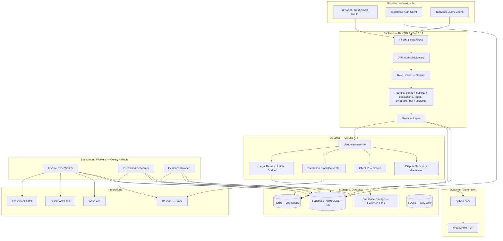
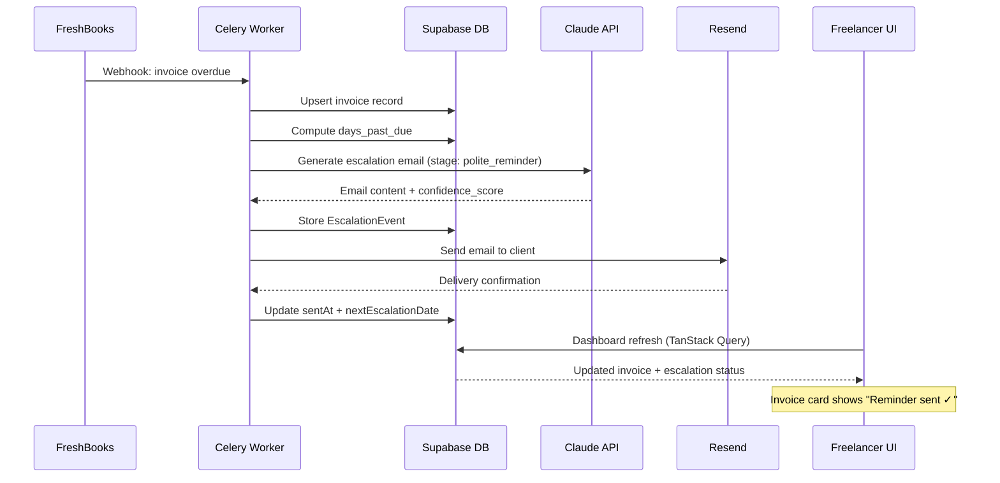

# Freelancer "Bad Cop" CRM

> **Your AI bad cop for unpaid invoices.**
> Stop chasing clients. Start getting paid.

An AI-native payment protection SaaS that automates the emotionally loaded work of chasing unpaid invoices. The product acts as the "bad cop" — escalating from polite reminder to legal demand letter — so the freelancer stays the "good cop."

**Built by [Rudrendu Paul](https://github.com/RudrenduPaul) & Sourav Nandy** | Developed with [Claude Code](https://claude.ai/code)

[](https://github.com/RudrenduPaul/freelancer-payment-protection/actions/workflows/ci.yml)
[](https://github.com/RudrenduPaul/freelancer-payment-protection/actions/workflows/security.yml)
[](./LICENSE)

---

## The Problem

Freelancers experience a uniquely humiliating form of financial harm: doing the work, delivering the result, and then being ghosted or strung along on payment. The brutal double bind:

- **Chase too softly:** The client ignores you. The money never arrives.
- **Chase too hard:** The client labels you "difficult." The relationship — and referrals — are destroyed.

**The market:** $1.5B freelance management/invoicing market. 73M US freelancers. **71% experience late payment.** No existing tool combines AI legal drafting, evidence capture, and risk scoring in a product built specifically for collection — not invoicing.

---

## How It Works — The Escalation Lifecycle

```
Invoice Created → Polite Reminder → Firm Notice → Final Warning → Legal Demand → Legal Action
```

| Stage | Days Past Due | Tone | What Claude Does |
|-------|--------------|------|-----------------|
| **Polite Reminder** | 1–7 | Warm, professional | "Just checking in" email |
| **Firm Notice** | 8–14 | Direct | References contract terms, sets 7-day deadline |
| **Final Warning** | 15–21 | Authoritative | Final notice, threatens formal process |
| **Legal Demand** | 22–30 | Legal, formal | Jurisdiction-aware demand letter PDF |
| **Legal Action** | 30+ | Court documentation | Small claims prep doc, evidence summary |

The product is the aggressive party. The freelancer is always the professional who "just uses a billing tool."

---

## Product Screenshots

> _All screenshots from the demo environment — seed data included, no credentials required_

**Dashboard** — Total outstanding, overdue count, recovery rate, client risk distribution

**Escalation Pipeline** — 5-stage kanban view showing exactly where every invoice sits in the collection process

```
┌──────────────────┬──────────────────┬──────────────────┬──────────────────┬──────────────────┐
│ POLITE REMINDER  │   FIRM NOTICE    │  FINAL WARNING   │  LEGAL DEMAND    │  LEGAL ACTION    │
│      (14)        │      (7)         │      (4)         │      (3)         │      (2)         │
├──────────────────┼──────────────────┼──────────────────┼──────────────────┼──────────────────┤
│  Acme Corp       │  Designco        │  Webb & Sons     │  Vanishing       │  Ghost Inc.      │
│  INV-0041        │  INV-0039        │  INV-0031        │  Act LLC         │  INV-0012        │
│  $8,500          │  $3,200          │  $15,000         │  $22,000         │  $4,750          │
│  8 days late     │  18 days late    │  28 days late    │  127 days late   │  94 days late    │
└──────────────────┴──────────────────┴──────────────────┴──────────────────┴──────────────────┘
```

**Demand Letter Generation** — Watch Claude draft a jurisdiction-aware legal document in real time (streaming typewriter effect)

**Evidence Locker** — Auto-captured emails, contracts, and screenshots organized into a court-ready export

**Client Risk Scores** — AI-scored 0–100 with full factor breakdown: industry, payment history, contract quality

---

## Tech Stack

| Layer | Technology | Why |
|-------|-----------|-----|
| **Monorepo** | Turborepo + pnpm workspaces | Parallel builds, shared cache, single `pnpm install`. Signals engineering maturity. |
| **Frontend** | Next.js 14 App Router | Server Components, streaming SSR, built-in BFF API routes. |
| **UI** | Tailwind CSS + shadcn/ui | Unstyled, accessible, your code — not vendor lock-in. |
| **Animations** | Framer Motion | Production-grade animation (Stripe, Linear, Vercel use it). Confetti on payment, risk score reveal, escalation progress. |
| **State** | Zustand + TanStack Query | Zustand for client state; TanStack Query for server state with optimistic updates. |
| **Validation** | Zod (FE) + Pydantic v2 (BE) | Single source of truth for data shapes on both sides of the wire. |
| **Backend** | Python 3.12 + FastAPI | Chosen for legal doc generation: python-docx, WeasyPrint, LangChain all Python-native. |
| **ORM** | SQLAlchemy + Alembic | Type-safe, reviewable migrations. Schema is plain Python. No magic. |
| **Database** | Supabase (PostgreSQL) | Auth, Realtime, Row Level Security, and Storage — production-ready, zero config. |
| **Dev DB** | SQLite via SQLAlchemy | Full seed data — no credentials needed to explore locally. Identical schema to Postgres. |
| **Auth** | Supabase JWT + httpOnly cookies + PKCE | Industry-standard secure auth. RLS enforces data isolation at the DB layer. |
| **AI** | Anthropic Claude API (claude-sonnet-4-6) | Best-in-class for structured output and legal drafting. |
| **Document Gen** | python-docx + WeasyPrint | Word-format letters → pixel-perfect PDF output from HTML/CSS templates. |
| **Invoice Sync** | FreshBooks, QuickBooks, Wave APIs | Full OAuth connectors — covers the entire freelancer accounting tool market. |
| **Email** | Resend + React Email | Templates are React components — testable, version-controlled, professional. |
| **Queue** | Celery + Redis | Durable async jobs: invoice sync, reminder schedules, evidence scraping. |
| **Testing** | pytest + Playwright | pytest for unit/integration; Playwright for E2E critical paths. |
| **CI/CD** | GitHub Actions | Lint → Typecheck → Test → Security audit on every PR. Merge blocked on failure. |
| **Rate Limiting** | slowapi | 100 req/min per IP, 10/min on legal doc routes — configurable per endpoint. |

---

## Architecture



### Data Flow: Invoice to Escalation



---

## AI Features

The AI layer is central to the product — not a bolt-on. All Claude calls route through `packages/legal-ai/client.py`.

### Legal Demand Letter Generation

Claude drafts jurisdiction-aware demand letters that:
- Reference exact invoice number, amount, and due date
- List all previous contact attempts chronologically
- State a clear 7-business-day final deadline
- Specify consequences: credit reporting, small claims, collections referral
- Adapt language to jurisdiction (California, New York, Texas, England/Wales, Ontario)

Every generated document includes:
```
DISCLAIMER: This document was generated with AI assistance and does not
constitute legal advice. Review with a qualified attorney before sending.
```

### Client Risk Scoring (0–100)

Claude scores every client using:
- Industry payment culture (entertainment = higher risk than enterprise SaaS)
- Payment terms (Net 60+ = higher risk than Net 14)
- Historical payment delay (average days late from history)
- Contract quality (signed contract vs. verbal agreement)
- Invoice amount relative to client size

Returns `{score, level, factors[], reasoning}` — the UI shows the full factor breakdown, not just a number.

| Score | Level | Color | Recommended Action |
|-------|-------|-------|-------------------|
| 0–25 | Low | Green | Standard terms |
| 26–50 | Medium | Yellow | Deposit recommended |
| 51–75 | High | Amber | 50% upfront required |
| 76–100 | Critical | Red | Do not start work without payment |

### Escalation Email Generator

Stage-calibrated tone across 5 stages. Returns structured `{subject, body, tone, confidence_score, key_phrases}`. Confidence score is displayed alongside every AI draft in the UI.

### MLP Delight Animations

| Moment | Animation |
|--------|-----------|
| Invoice paid | Full confetti + card flashes green + "Justice served. $X received." |
| Risk score reveal | Counts up 0 → score with color transition: green → amber → red |
| Escalation progress | Visual timeline with next step pulsing |
| Evidence captured | Document count badge animates (+1) |
| Overdue 30+ days | Subtle red pulse ring around invoice card |
| All paid empty state | "Your clients all paid on time. For now." |
| AI drafting | Streaming typewriter renders each word in real time |

---

## Security

Security is built in from day one — not added as a phase.

| Category | Implementation | Location |
|----------|---------------|----------|
| **Auth** | Supabase JWT, httpOnly cookies, PKCE flow | `apps/web/middleware.ts` |
| **Authorization** | Row Level Security on every table — workspace isolation | `packages/db/migrations/versions/002_rls_policies.sql` |
| **Input Validation** | Pydantic v2 on every FastAPI endpoint | `apps/api/app/schemas/` |
| **Rate Limiting** | slowapi — 100 req/min, 10/min on legal routes | `apps/api/app/middleware/rate_limit.py` |
| **CORS** | Allowlist-based — no wildcard in production | `apps/api/app/middleware/cors.py` |
| **SQL Injection** | SQLAlchemy ORM only — no raw SQL | `apps/api/app/models/` |
| **XSS** | React built-in escaping + strict CSP headers | `apps/web/next.config.ts` |
| **API Keys** | Never in client bundle — server-side via Pydantic Settings only | `apps/api/app/config.py` |
| **Secrets** | Fail-fast validation on startup — app refuses to start without required vars | `apps/api/app/config.py` |
| **Dependency Audit** | `safety` + `pip-audit` on every PR | `.github/workflows/security.yml` |
| **SAST** | CodeQL scanning (Python + TypeScript) on every PR | `.github/workflows/security.yml` |
| **Evidence Storage** | Supabase Storage with signed URLs — 1-hour expiry, no public access | `apps/api/app/routers/evidence.py` |

---

## Repository Structure

```
freelancer-payment-protection/
├── apps/
│   ├── web/                    # Next.js 14 App Router dashboard
│   │   ├── app/
│   │   │   ├── (auth)/         # Login, signup, onboarding
│   │   │   └── (dashboard)/    # All protected pages
│   │   │       ├── page.tsx            # Dashboard overview
│   │   │       ├── clients/            # Client table + risk scores
│   │   │       ├── invoices/           # Invoice list + overdue alerts
│   │   │       ├── escalations/        # Escalation pipeline kanban
│   │   │       ├── evidence/           # Evidence locker
│   │   │       ├── analytics/          # Recovery metrics + charts
│   │   │       └── settings/           # Integrations, billing, profile
│   │   └── components/
│   │       ├── ui/                     # shadcn/ui primitives
│   │       ├── clients/                # ClientCard, RiskScoreBadge, etc.
│   │       ├── invoices/               # InvoiceRow, OverdueAlertPulse, etc.
│   │       ├── escalations/            # EscalationPipeline, DemandLetterPreview
│   │       ├── evidence/               # EvidenceLocker, EvidenceUpload
│   │       ├── analytics/              # RecoveryRateChart, OverdueTrendChart
│   │       └── shared/                 # Sidebar, ConfettiCelebration, StreamingText
│   │
│   ├── api/                            # FastAPI backend (Python 3.12)
│   │   └── app/
│   │       ├── main.py                 # FastAPI app factory + lifespan
│   │       ├── config.py               # Pydantic Settings (fail-fast env validation)
│   │       ├── routers/                # clients, invoices, escalations, legal, evidence, risk, analytics
│   │       ├── services/               # ai_service, escalation_service, doc_gen_service, risk_service
│   │       ├── middleware/             # auth, rate_limit, cors
│   │       ├── models/                 # SQLAlchemy ORM models
│   │       └── schemas/                # Pydantic request/response schemas
│   │
│   └── workers/                        # Celery background jobs
│       └── tasks/                      # invoice_sync, reminder_scheduler, evidence_scraper
│
├── packages/
│   ├── db/
│   │   ├── migrations/                 # Alembic migration files
│   │   └── seeds/                      # 50 clients, 50 invoices, 20 escalation events
│   ├── legal-ai/                       # Claude prompt templates + Anthropic SDK wrapper
│   │   └── prompts/                    # demand_letter, escalation_sequence, risk_scoring, dispute_summary
│   ├── doc-gen/                        # python-docx + WeasyPrint PDF pipeline
│   ├── integrations/                   # FreshBooks, QuickBooks, Wave connectors
│   └── types/                          # Shared TypeScript types
│
├── .claude/
│   ├── agents/                         # 6 specialized sub-agents
│   └── commands/                       # Custom slash commands
│
├── .github/workflows/                  # CI, security audit, PR quality gates
├── docs/architecture/                  # System design, security, AI layer, data model ADRs
└── legal-templates/                    # Jurisdiction-specific demand letter base templates
```

---

## Getting Started

**No credentials needed.** All features run against local seed data using SQLite.

### Prerequisites

- Node.js 20+
- pnpm 9+
- Python 3.12+
- Redis (for background workers — optional for basic UI exploration)

### Install and Run

```bash
# Clone the repo
git clone https://github.com/RudrenduPaul/freelancer-payment-protection.git
cd freelancer-payment-protection

# Install all JS/TS dependencies (monorepo)
pnpm install

# Set up environment files (placeholder values are pre-filled for local dev)
cp apps/api/.env.example apps/api/.env
cp apps/web/.env.example apps/web/.env.local

# Set up Python dependencies
cd apps/api
pip install -r requirements.txt

# Initialize the dev database and load seed data
python -m alembic upgrade head
python scripts/seed_db.py

cd ../..

# Start everything
pnpm dev
```

The app runs at:
- **Dashboard:** `http://localhost:3000`
- **FastAPI + OpenAPI docs:** `http://localhost:8000/docs`

### Demo Login

```
Email:    demo@badcopcr.com
Password: demo123
```

The demo workspace includes 50 mock clients across all risk levels, 50 invoices across all statuses, and pre-generated escalation events and evidence items — all seeded locally, no external services required.

> **AI features** (demand letter generation, risk scoring) require a valid `ANTHROPIC_API_KEY` in `apps/api/.env`. See `.env.example` for the variable name. Never commit real keys.

---

## API Documentation

FastAPI auto-generates the full interactive OpenAPI spec at `http://localhost:8000/docs` when running locally.

### Sample API Calls

```bash
# List high-risk clients
curl http://localhost:8000/api/v1/clients?risk_level=high

# AI-draft the next escalation email (preview before sending)
curl -X POST http://localhost:8000/api/v1/escalations/inv_001/draft \
  -H "Authorization: Bearer <token>"

# Generate a legal demand letter
curl -X POST http://localhost:8000/api/v1/legal/demand-letter \
  -H "Authorization: Bearer <token>" \
  -H "Content-Type: application/json" \
  -d '{
    "invoice_id": "inv_001",
    "jurisdiction": "us-california",
    "client_name": "Marcus Webb",
    "amount": 8500.00,
    "days_past_due": 52
  }'

# Get AI risk score for a client
curl -X POST http://localhost:8000/api/v1/risk/score \
  -H "Authorization: Bearer <token>" \
  -H "Content-Type: application/json" \
  -d '{"client_id": "client_001"}'
```

### Full API Surface

```
# Health
GET    /health                             Liveness probe
GET    /health/ready                       Readiness probe (DB + Redis)

# Clients
GET    /api/v1/clients                     List clients (filterable by risk level)
POST   /api/v1/clients                     Create client
GET    /api/v1/clients/{id}                Client detail
PUT    /api/v1/clients/{id}                Update client
DELETE /api/v1/clients/{id}                Soft delete
PATCH  /api/v1/clients/{id}/risk-score     Trigger AI risk score recomputation

# Invoices
GET    /api/v1/invoices                    List invoices (filterable by status, date)
POST   /api/v1/invoices                    Create invoice (manual)
GET    /api/v1/invoices/{id}               Invoice detail + escalation timeline
PATCH  /api/v1/invoices/{id}/status        Update invoice status
POST   /api/v1/invoices/sync               Trigger sync from connected integration
GET    /api/v1/invoices/{id}/timeline      Full escalation + event timeline

# Escalations
GET    /api/v1/escalations                 List active escalations
POST   /api/v1/escalations/{id}/trigger    Trigger next escalation stage
POST   /api/v1/escalations/{id}/draft      AI-draft next email (preview)
POST   /api/v1/escalations/{id}/send       Send escalation email via Resend
GET    /api/v1/escalations/{id}/history    Full escalation history for invoice

# Legal Documents
POST   /api/v1/legal/demand-letter         Generate demand letter PDF
POST   /api/v1/legal/breach-notice         Generate contract breach notice PDF
POST   /api/v1/legal/small-claims-prep     Generate small claims court prep doc
GET    /api/v1/legal/{document_id}/download  Download PDF (signed URL)

# Evidence
GET    /api/v1/evidence/{invoice_id}       List evidence items
POST   /api/v1/evidence/{invoice_id}/upload  Manual evidence upload
DELETE /api/v1/evidence/{item_id}          Remove evidence item
GET    /api/v1/evidence/{invoice_id}/export  Court-ready ZIP export

# Risk Scoring
POST   /api/v1/risk/score                  Compute risk score for a client
GET    /api/v1/risk/{client_id}/report     Full risk assessment report
POST   /api/v1/risk/contract-review        Flag payment red flags in an uploaded contract

# Analytics
GET    /api/v1/analytics/overview          Dashboard metrics (totals, recovery rate)
GET    /api/v1/analytics/recovery-trend    Monthly recovery rate (last 12 months)
GET    /api/v1/analytics/overdue-aging     Aging report: invoices by days-past-due bucket
GET    /api/v1/analytics/escalation-effectiveness  Recovery rate by escalation stage
```

---

## Claude Code Sub-Agents

This repo ships with 6 specialized Claude Code sub-agents in `.claude/agents/`:

| Agent | Owns |
|-------|------|
| `legal-ai-agent` | All Claude prompt templates, demand letter generation, disclaimer enforcement |
| `escalation-agent` | Escalation timing engine, email sequence quality, stage progression rules |
| `integration-agent` | FreshBooks/QuickBooks/Wave connectors, OAuth token handling, retry logic |
| `risk-scoring-agent` | Risk model, scoring factors, thresholds, synthetic test data |
| `evidence-locker-agent` | Evidence capture pipeline, Supabase Storage, court-ready export |
| `test-agent` | pytest, Playwright E2E, coverage gates, adversarial test cases |

Custom slash commands:
- `/new-escalation-template <stage>` — scaffold new escalation email template + test
- `/generate-demand-letter <invoice_id>` — generate demand letter for specific invoice
- `/review-pr` — security + performance + MLP lovability review

---

## Competitive Landscape

| Feature | Spreadsheets | FreshBooks | HoneyBook | HubSpot | Bad Cop CRM |
|---------|-------------|-----------|-----------|---------|-------------|
| Auto-escalation sequence | Manual only | Reminders only | Basic reminders | Manual sequences | AI-powered, stage-aware |
| Legal demand letter gen | No | No | No | No | Jurisdiction-aware PDF |
| Client risk scoring | No | No | No | No | AI-scored 0–100 |
| Evidence locker | No | No | No | No | Auto-captured + court export |
| Dispute dashboard | No | No | No | No | Court-ready ZIP |
| Invoice source integrations | Manual | Native | Native | Manual | FreshBooks / QB / Wave |
| Streaming AI generation | No | No | No | No | Typewriter effect |
| Delight animations | No | Minimal | Minimal | Minimal | Framer Motion |
| Price | $0 (broken) | $17–55/mo | $16–66/mo | $45–800/mo | $29–99/mo |

**The moat:** No competitor combines AI legal drafting + evidence capture + risk scoring in a product built specifically for freelancers. FreshBooks and HoneyBook handle invoicing. None handle the emotional, legal, and psychological challenge of actually collecting.

---

## Pricing

| Plan | Price | Clients | Key Features |
|------|-------|---------|-------------|
| **Solo** | $29/mo | 10 active | Basic escalations, 3 legal docs/mo, manual evidence upload |
| **Pro** | $59/mo | Unlimited | Unlimited AI legal docs, evidence locker, risk scoring, all integrations |
| **Agency** | $99/mo | Unlimited | Multi-user, white-label client portal, API access, priority support |

Annual discount: 20% off all plans.

---

## Roadmap

**V1 (Current):** Invoice tracking, AI escalation sequences, legal demand letter generation, evidence locker, client risk scoring, FreshBooks/QuickBooks/Wave integrations.

**V2:** Stripe billing, Zapier connector, mobile PWA, attorney review marketplace, Freelancer Collective Defense registry (anonymized database of known non-payers).

**V3:** Optional 2% success fee on recovered invoices over $10K, white-label reseller program, contract analysis at signing (not just at dispute).

---

## Running Tests

```bash
# Backend — pytest with coverage report
cd apps/api
pytest --cov=app --cov-report=term-missing

# Frontend — Vitest component tests
pnpm --filter web test

# E2E — Playwright (full browser tests)
pnpm --filter web test:e2e

# Full CI suite via Turborepo
pnpm turbo test
```

CI requirements:
- 70% minimum line coverage on every PR (enforced by `--cov-fail-under=70`)
- 90%+ coverage on: risk scoring, escalation service, doc generation
- Every new API route: happy path test + auth failure test + validation error test
- No live API calls in tests — all external calls mocked

---

## About the Builders

**Rudrendu Paul** and **Sourav Nandy** built the Freelancer Bad Cop CRM as an accelerator-ready engineering showcase demonstrating senior-level software architecture, production-grade security practices, and deep AI integration.

The core product — including AI demand letter generation, evidence locker, and risk scoring — was built in 15 days using Claude Code with 6 specialized sub-agents running in parallel.

> "We used Claude Code as our primary development environment. Our `CLAUDE.md` defines the entire architecture and coding standards. Six specialized sub-agents run in parallel. MCP servers connect Claude Code directly to our Supabase DB and GitHub repo during development. Without Claude Code, our estimate was 8–10 weeks."

---

## License

This project is the exclusive intellectual property of **Rudrendu Paul** and **Sourav Nandy**.

Any use of this software — personal, academic, commercial, or otherwise — requires prior written approval from both owners. See [LICENSE](./LICENSE) for full terms.

To request permission: [github.com/RudrenduPaul](https://github.com/RudrenduPaul)

---

*Built by Rudrendu Paul and Sourav Nandy, developed with [Claude Code](https://claude.ai/code).*
