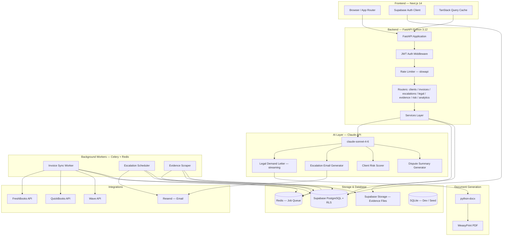
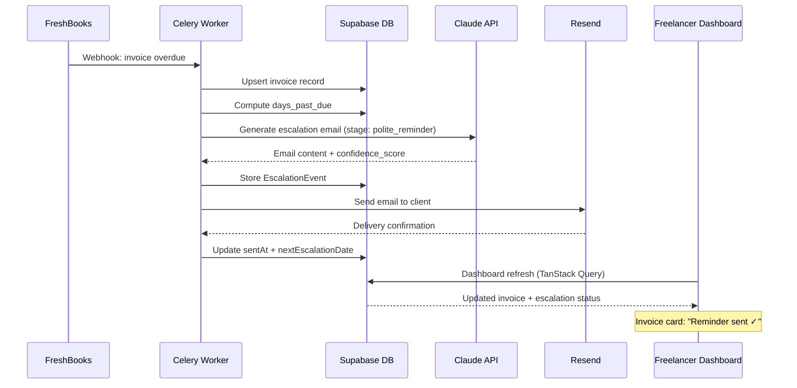

<div align="center">

<h1>🛡️ Freelancer "Bad Cop" CRM</h1>

<p><strong>52 million freelancers get stiffed every year. We built the bad cop so they don't have to be.</strong><br/>
AI-native payment protection that automates escalation, drafts jurisdiction-aware legal documents,<br/>and scores client risk — so you stay the professional while the product does the uncomfortable part.</p>

<hr/>

<!-- Activity badges -->
<p>
  
  
  
</p>

<!-- Core stack -->
<p>
  
  
  
  
  
</p>

<!-- AI & Data -->
<p>
  
  
  
  
  
</p>

<!-- CI & License -->
<p>
  
  
  
</p>

<p>
  Built by <strong>Rudrendu Paul</strong> &amp; <strong>Sourav Nandy</strong> &nbsp;·&nbsp; Developed with <a href="https://claude.ai/code">Claude Code</a> &nbsp;·&nbsp; Core product shipped in <strong>15 days</strong> with 6 parallel sub-agents
</p>

<p>
  <a href="#the-problem">The Problem</a> &nbsp;·&nbsp;
  <a href="#the-product">The Product</a> &nbsp;·&nbsp;
  <a href="#quick-start">Quick Start</a> &nbsp;·&nbsp;
  <a href="#ai-under-the-hood">AI Features</a> &nbsp;·&nbsp;
  <a href="#sub-agent-architecture">Sub-Agents</a> &nbsp;·&nbsp;
  <a href="#system-architecture">Architecture</a>
</p>

<!--
  📸 DROP A SCREENSHOT HERE
  Recommended: 1280×800 dashboard showing the escalation kanban + risk score badges
  Save to /docs/screenshots/dashboard.png and uncomment the line below.
  A GIF of the streaming demand letter typewriter effect would be 🔥
-->
<!--  -->

</div>

---

## The Problem

There are 73 million freelancers in the US. 71% report experiencing late payment. That's roughly 52 million people who did the work, delivered the result, and then spent weeks hoping a client would pay.

What makes it uniquely bad is the double bind. Chase softly — the client ignores you. Chase hard — you're "difficult to work with," referrals dry up, the relationship is strained. Some clients understand this leverage and use it deliberately. The freelancer ends up absorbing the loss just to protect their reputation.

The existing tools don't help. FreshBooks, HoneyBook, HubSpot — they handle invoicing. None of them handle collection. There's nothing on the market that combines AI-drafted legal documents, automated escalation sequences, evidence capture, and client risk scoring built specifically for this workflow.

That's the gap. This fills it.

---

## The Product

An AI-native payment protection SaaS that plays the "bad cop" on behalf of the freelancer. It manages the entire collection process — from a warm first reminder all the way to a jurisdiction-aware legal demand letter and a court-ready evidence export. The freelancer stays the professional who "just uses a billing tool." The product does the uncomfortable part.

Every email, every demand letter, every risk assessment runs through Claude (claude-sonnet-4-6) — with confidence scores returned to the UI alongside every generated document, so the freelancer sees exactly how the model is reading the situation before they approve and send.

---

## The Escalation Pipeline

Five stages. Minimum wait times enforced in the engine — not in the UI, not as suggestions. A direct API call can't skip the window. The scheduler won't queue the next stage until the clock has run.

```
Invoice Overdue → Polite Reminder → Firm Notice → Final Warning → Legal Demand → Legal Action
```

| Stage | Days Past Due | Tone | What Claude Generates | Min Wait |
|-------|:------------:|------|----------------------|:--------:|
| **Polite Reminder** | 1–7 | Warm, professional | "Just checking in" email with invoice summary | 7 days |
| **Firm Notice** | 8–14 | Direct | References contract terms, sets a 7-day deadline | 7 days |
| **Final Warning** | 15–21 | Authoritative | Final notice before formal process begins | 5 days |
| **Legal Demand** | 22–30 | Formal, legal | Jurisdiction-aware demand letter PDF | 7 days |
| **Legal Action** | 30+ | Documentation | Small claims prep doc, full evidence summary | — |

---

## AI Under the Hood

Claude isn't a feature here. The product doesn't work without it. Three systems do the actual work:

### Legal Demand Letter Generation

Claude drafts jurisdiction-aware demand letters for California, New York, Texas, England/Wales, and Ontario. Each letter references the exact invoice number, amount, and due date; lists previous contact attempts chronologically; sets a 7-business-day final deadline; and specifies consequences (credit reporting, small claims, collections referral).

Every generated document carries this disclaimer at the top — enforced in the system prompt, verified by the legal-ai-agent, non-negotiable:

```
DISCLAIMER: This document was generated with AI assistance and does not
constitute legal advice. Review with a qualified attorney before sending.
```

The letter streams to the frontend in real time. The Anthropic Python SDK is synchronous; FastAPI is async. We bridge them with a `threading.Thread` pushing chunks into a `queue.Queue`, then `loop.run_in_executor` pulls from the queue on the async side. The event loop never blocks. The typewriter effect in the UI is smooth. It's not the most elegant pattern — but it's correct.

### Client Risk Scoring

Claude scores every client from 0 to 100 using seven weighted factors: industry payment culture, payment terms length, historical delay average, contract quality, outstanding balance as a percentage of total invoiced, invoice amount relative to client size, and geographic signals. The model returns structured JSON — `{score, level, factors[], reasoning}` — and the UI shows the full factor breakdown, not just the number. A score without reasoning is noise.

| Score | Level | What It Means |
|:-----:|:-----:|---------------|
| 0–25 | 🟢 Low | Standard terms are fine |
| 26–50 | 🟡 Medium | Deposit or milestone payments worth considering |
| 51–75 | 🟠 High | 50% upfront before starting |
| 76–100 | 🔴 Critical | Full payment before any work begins |

### Escalation Email Generator

Stage-calibrated drafts with structured output: `{subject, body, tone, confidence_score, key_phrases}`. The confidence score surfaces in the UI next to every draft — freelancers see how certain the model is about the tone calibration before they hit send.

---

## MCP-Powered Development

We used Model Context Protocol servers throughout development. The difference isn't marginal — it's the gap between writing code that guesses at API behavior and writing code validated against live data.

| MCP Server | What It Did During Development |
|------------|-------------------------------|
| **Supabase MCP** | Schema queries, migration checks, RLS policy validation in plain language — Claude Code read our actual schema before writing a single query |
| **GitHub MCP** | PR creation, diff review, CI status — all from the Claude Code terminal |
| **Gmail MCP** | Built and tested escalation email flows against real email threads; powered the evidence scraper |
| **DocuSign MCP** | Wired up digital signature for demand letters with live API validation |
| **QuickBooks MCP** | Real invoice data during integration development — no mocked responses that drift from production |
| **Sequential Thinking MCP** | Used specifically for risk scoring — forces step-by-step reasoning through payment risk factors before a score is produced |

With Supabase MCP, Claude Code read the actual schema before writing a migration. With Gmail MCP, the evidence scraper was tested against real threads, not fabricated fixtures. Every external call was validated against the live API before it shipped.

---

## Sub-Agent Architecture

Six specialized sub-agents ran in parallel during development. Each one has a specific domain and strict file-system boundaries — which meant the legal AI layer and the frontend pipeline could evolve simultaneously without merge conflicts or context collisions.

| Agent | Domain | File Boundaries |
|-------|--------|----------------|
| `legal-ai-agent` | Claude prompt templates, demand letter generation, disclaimer enforcement | `packages/legal-ai/` only |
| `escalation-agent` | Escalation timing engine, tone calibration, stage progression | `apps/api/app/services/escalation_service.py` |
| `integration-agent` | FreshBooks / QuickBooks / Wave OAuth connectors, token refresh, retry logic | `packages/integrations/` only |
| `risk-scoring-agent` | Risk model design, scoring factors, thresholds, synthetic test data | `apps/api/app/services/risk_service.py` |
| `evidence-locker-agent` | Evidence capture pipeline, Supabase Storage, signed URL management, court-ready ZIP | `apps/api/app/routers/evidence.py` |
| `test-agent` | pytest unit/integration tests, Playwright E2E, coverage gates, adversarial test cases for legal features | `**/tests/` only |

Custom commands in `.claude/commands/`:
```
/new-escalation-template <stage>   — scaffold a new email template + its pytest test in one shot
/generate-demand-letter <id>       — generate a demand letter for a specific invoice
/review-pr                         — run the security + performance + MLP lovability checklist
```

---

## Tech Stack

**Frontend**

Next.js 14 App Router with Tailwind CSS and shadcn/ui. Server Components handle data-heavy pages (the escalation kanban, the evidence locker) without client-side fetching overhead. Framer Motion runs all animations — confetti when a payment lands, the risk score counting up from 0 to the final number with a color shift, the typewriter render of streaming AI text. TanStack Query manages server state with optimistic updates; Zustand holds local UI state.

**Backend**

Python 3.12 with FastAPI. The Python choice was deliberate: python-docx and WeasyPrint for document generation, the Anthropic SDK for AI calls, and the broader Python ecosystem for anything legal-adjacent. One file per service, no business logic in routers.

**Database**

Supabase (PostgreSQL) in production. SQLite via SQLAlchemy for local development — identical schema, no credentials needed. Alembic manages migrations; schema changes go through migration files, never direct edits. Row Level Security enforces workspace isolation at the database layer, not just at the application layer.

**AI**

All Claude calls route through `packages/legal-ai/client.py`. Nothing calls the Anthropic SDK directly from routers, workers, or tests — enforced in `CLAUDE.md` and verified in every PR by the legal-ai-agent. The centralized wrapper handles synchronous and streaming calls, with the async/sync bridge handled via thread pool + `asyncio.run_in_executor`.

**Background Workers**

Celery + Redis. Three workers: invoice sync (pulls from FreshBooks/QuickBooks/Wave on a schedule and on webhook triggers), escalation scheduler (checks daily for invoices past the wait window and queues the next stage), and evidence scraper (captures and stores email threads and uploaded attachments).

**Infrastructure at a glance:**

| Layer | Choice | Why |
|-------|--------|-----|
| Monorepo | Turborepo + pnpm workspaces | Parallel builds with shared cache — frontend and Python backend build simultaneously |
| Auth | Supabase JWT + httpOnly cookies + PKCE | PKCE eliminates authorization code interception; httpOnly blocks XSS from reaching the token |
| Rate limiting | slowapi | 100 req/min globally, 10/min on legal doc routes — AI routes are expensive and need separate throttling |
| Validation | Zod (frontend) + Pydantic v2 (backend) | Same data shapes defined twice, in the language each side speaks natively |
| Email | Resend + React Email | Templates are React components — testable, version-controlled, predictable rendering across clients |

---

## System Architecture



### Data Flow: Overdue Invoice → Sent Escalation



---

## Quick Start

No credentials required. Every feature runs against local SQLite with seed data.

### Prerequisites

- Node.js 20+
- pnpm 9+
- Python 3.12+
- Redis _(only if you want to run background workers)_

### Five minutes to running

```bash
git clone https://github.com/RudrenduPaul/freelancer-payment-protection.git
cd freelancer-payment-protection

# Install JS/TS dependencies across the monorepo
pnpm install

# Copy env files — placeholder values work for local dev
cp apps/api/.env.example apps/api/.env
cp apps/web/.env.example apps/web/.env.local

# Set up Python
cd apps/api
pip install -r requirements.txt

# Initialize the SQLite dev database and load seed data
python -m alembic upgrade head
python scripts/seed_db.py

cd ../..

# Start everything
pnpm dev
```

| Service | URL |
|---------|-----|
| Dashboard | http://localhost:3000 |
| API + interactive docs | http://localhost:8000/docs |

```
Demo credentials
Email:    demo@badcopcr.com
Password: demo123
```

The demo workspace has 50 mock clients spread across all four risk levels, 50 invoices across every status, and pre-generated escalation events and evidence items. You can walk through the entire escalation pipeline and see risk score reveals without touching any external service.

> To use the AI features — demand letter generation, risk scoring, escalation email drafts — add a valid `ANTHROPIC_API_KEY` to `apps/api/.env`. The variable name is in `.env.example`. Never commit real keys.

---

## API Reference

FastAPI generates an interactive OpenAPI spec at `http://localhost:8000/docs`. The key endpoints:

```bash
# High-risk client list
GET  /api/v1/clients?risk_level=high

# AI-draft the next escalation email (preview before sending)
POST /api/v1/escalations/{id}/draft

# Generate a demand letter
POST /api/v1/legal/demand-letter
     { invoice_id, jurisdiction, client_name, amount, days_past_due }

# AI risk assessment for a client
POST /api/v1/risk/score
     { client_id }

# Court-ready evidence export
GET  /api/v1/evidence/{invoice_id}/export
```

<details>
<summary>Full endpoint surface</summary>

```
GET    /health                           Liveness
GET    /health/ready                     Readiness (DB + Redis)

GET    /api/v1/clients                   List (filter: risk_level, status)
POST   /api/v1/clients                   Create
GET    /api/v1/clients/{id}              Detail
PUT    /api/v1/clients/{id}              Update
DELETE /api/v1/clients/{id}              Soft delete
PATCH  /api/v1/clients/{id}/risk-score   Trigger AI rescore

GET    /api/v1/invoices                  List (filter: status, date range)
POST   /api/v1/invoices                  Create (manual)
GET    /api/v1/invoices/{id}             Detail + escalation timeline
PATCH  /api/v1/invoices/{id}/status      Update status
POST   /api/v1/invoices/sync             Pull from connected integration
GET    /api/v1/invoices/{id}/timeline    Full event history

GET    /api/v1/escalations               Active escalations
POST   /api/v1/escalations/{id}/trigger  Next stage
POST   /api/v1/escalations/{id}/draft    AI preview (before sending)
POST   /api/v1/escalations/{id}/send     Send via Resend
GET    /api/v1/escalations/{id}/history  Full history

POST   /api/v1/legal/demand-letter       Generate PDF
POST   /api/v1/legal/breach-notice       Generate PDF
POST   /api/v1/legal/small-claims-prep   Generate PDF
GET    /api/v1/legal/{doc_id}/download   Download (signed URL)

GET    /api/v1/evidence/{invoice_id}           Evidence items
POST   /api/v1/evidence/{invoice_id}/upload    Manual upload
DELETE /api/v1/evidence/{item_id}              Remove
GET    /api/v1/evidence/{invoice_id}/export    Court-ready ZIP

POST   /api/v1/risk/score                AI risk score
GET    /api/v1/risk/{client_id}/report   Full assessment report
POST   /api/v1/risk/contract-review      Flag payment red flags in a contract

GET    /api/v1/analytics/overview                   Dashboard totals + recovery rate
GET    /api/v1/analytics/recovery-trend             Monthly (last 12 months)
GET    /api/v1/analytics/overdue-aging              Aging report by days-past-due bucket
GET    /api/v1/analytics/escalation-effectiveness   Recovery rate by stage
```
</details>

---

## Security

Security was in from day one.

| Category | What We Built | Where |
|----------|--------------|-------|
| **Auth** | Supabase JWT, httpOnly cookies, PKCE flow | `apps/web/middleware.ts` |
| **Authorization** | Row Level Security on every table — workspace isolation at the DB layer, not app layer | `packages/db/migrations/versions/002_rls_policies.sql` |
| **Secrets management** | Pydantic Settings with `SecretStr` — app refuses to start if any required var is missing | `apps/api/app/config.py` |
| **Input validation** | Pydantic v2 on every FastAPI endpoint — malformed requests rejected before hitting business logic | `apps/api/app/schemas/` |
| **Rate limiting** | 100 req/min per IP; 10/min on legal doc routes | `apps/api/app/middleware/rate_limit.py` |
| **CORS** | Allowlist-based — no wildcard in production | `apps/api/app/middleware/cors.py` |
| **SQL injection** | SQLAlchemy ORM only — no raw SQL in the codebase | `apps/api/app/models/` |
| **XSS** | React's built-in escaping + strict Content Security Policy | `apps/web/next.config.ts` |
| **API key handling** | Never in the client bundle — loaded via Pydantic Settings on the server | `apps/api/app/config.py` |
| **Evidence storage** | Supabase Storage with signed URLs — 1-hour expiry, no public access | `apps/api/app/routers/evidence.py` |
| **Dependency audit** | `safety` + `pip-audit` on every PR; merge blocked on findings | `.github/workflows/security.yml` |
| **SAST** | CodeQL scanning (Python + TypeScript) on every PR | `.github/workflows/security.yml` |

The fail-fast pattern in `config.py` is worth calling out: `settings = Settings()` runs at module import time. If `ANTHROPIC_API_KEY` or any required variable is absent, the app raises a `ValidationError` before serving a single request. No silent failures.

---

## What No Competitor Does

| Capability | Spreadsheets | FreshBooks | HoneyBook | HubSpot | Bad Cop CRM |
|------------|:-----------:|:----------:|:---------:|:-------:|:-----------:|
| AI escalation sequence | Manual | Reminders only | Basic reminders | Manual sequences | Stage-aware, tone-calibrated |
| Jurisdiction-aware demand letters | ✗ | ✗ | ✗ | ✗ | CA / NY / TX / UK / Ontario |
| Client risk scoring | ✗ | ✗ | ✗ | ✗ | 0–100 with factor breakdown |
| Evidence locker + court export | ✗ | ✗ | ✗ | ✗ | Auto-captured, ZIP download |
| Streaming AI generation | ✗ | ✗ | ✗ | ✗ | Typewriter render, live |
| Invoice sync integrations | Manual | Native | Native | Manual | FreshBooks / QuickBooks / Wave |
| Minimum wait times enforced | N/A | N/A | N/A | N/A | Engine-level, not UI |

The gap isn't a single missing feature. Invoicing tools don't touch collection. CRMs don't generate legal documents. None of them act as a psychological buffer between the freelancer and their client. That combination is what's new.

---

## Repository Structure

```
freelancer-payment-protection/
├── apps/
│   ├── web/                          # Next.js 14 App Router
│   │   └── src/
│   │       ├── app/
│   │       │   ├── (auth)/           # Login, signup, onboarding
│   │       │   ├── dashboard/        # Overview metrics
│   │       │   ├── clients/          # Client table + risk scores + [id] detail
│   │       │   ├── invoices/         # Invoice list + overdue alerts + [id] timeline
│   │       │   ├── escalations/      # 5-column kanban pipeline
│   │       │   ├── legal/            # Demand letter generation + streaming preview
│   │       │   └── api/              # Next.js BFF routes
│   │       └── components/
│   │           ├── ui/               # shadcn/ui primitives
│   │           ├── clients/          # ClientCard, RiskScoreBadge, ClientDetailPanel
│   │           ├── invoices/         # InvoiceRow, OverdueAlertPulse, EscalationTimeline
│   │           ├── escalations/      # EscalationPipeline, DemandLetterPreview
│   │           ├── evidence/         # EvidenceLocker, EvidenceUpload
│   │           ├── analytics/        # RecoveryRateChart, OverdueTrendChart, RiskDistributionPie
│   │           ├── dashboard/        # MetricCard, RiskDistributionChart
│   │           └── shared/           # EmptyState, LoadingSkeleton, StreamingText, ConfettiCelebration
│   │
│   ├── api/                          # FastAPI backend (Python 3.12)
│   │   └── app/
│   │       ├── main.py               # App factory + lifespan
│   │       ├── config.py             # Pydantic Settings — fail-fast env validation
│   │       ├── database.py           # SQLAlchemy engine + session factory
│   │       ├── routers/              # clients, invoices, escalations, legal_docs, evidence, risk_scoring, analytics, health
│   │       ├── services/             # ai_service, escalation_service, doc_gen_service, risk_service
│   │       ├── middleware/           # auth, rate_limit, cors
│   │       ├── models/               # SQLAlchemy ORM models
│   │       └── schemas/              # Pydantic request/response schemas
│   │
│   └── workers/                      # Celery background workers
│       └── tasks/                    # invoice_sync, reminder_scheduler, evidence_scraper
│
├── packages/
│   ├── db/
│   │   ├── migrations/               # Alembic migration files (schema lives here, never direct edits)
│   │   │   └── versions/
│   │   │       ├── 001_initial_schema.py
│   │   │       └── 002_rls_policies.sql
│   │   ├── models/                   # SQLAlchemy models (client, invoice, escalation, evidence, workspace)
│   │   └── seeds/                    # 50 clients, 50 invoices, 20 escalation events — no credentials needed
│   │
│   ├── legal-ai/                     # Central Claude wrapper + all prompt templates
│   │   ├── client.py                 # THE only place Anthropic SDK is called
│   │   └── prompts/
│   │       ├── demand_letter.py      # Jurisdiction-aware demand letter prompt
│   │       ├── escalation_sequence.py
│   │       ├── risk_scoring.py       # Structured JSON output — {score, level, factors[], reasoning}
│   │       └── dispute_summary.py
│   │
│   ├── doc-gen/                      # python-docx + WeasyPrint PDF pipeline
│   ├── integrations/                 # FreshBooks, QuickBooks, Wave OAuth connectors
│   └── types/                        # Shared TypeScript types (no `any` — enforced by CI)
│
├── .claude/
│   ├── agents/                       # 6 specialized sub-agents (one per domain)
│   └── commands/                     # /new-escalation-template, /generate-demand-letter, /review-pr
│
├── .github/workflows/                # CI (lint → typecheck → test), security audit, PR quality gates
├── legal-templates/                  # Jurisdiction-specific base templates
└── scripts/                          # seed_db.py and dev utilities
```

---

## Running Tests

```bash
# Backend — pytest with coverage
cd apps/api
pytest --cov=app --cov-report=term-missing

# Frontend — Vitest
pnpm --filter web test

# E2E — Playwright
pnpm --filter web test:e2e

# Full CI pipeline via Turborepo
pnpm turbo test
```

Coverage requirements enforced by CI:
- 70% minimum line coverage on all PRs (`--cov-fail-under=70`)
- 90%+ on risk scoring, escalation service, and document generation
- Every new API route: happy path + auth failure + validation error
- No live external API calls in the test suite — everything mocked

---

## Design Decisions

**Why Python for the backend, not Node?**
Legal document generation. python-docx and WeasyPrint give us court-quality PDF output with real template control. Generating documents from a Node backend would have meant headless Chrome or a library with far less precision.

**Why SQLite for dev instead of local Postgres?**
No Docker, no install, no credentials. Anyone evaluating this repo can run it in five minutes. SQLAlchemy's dialect system means the ORM layer is identical across SQLite and Postgres — only the connection string changes.

**Why centralize all Claude calls in one module?**
`packages/legal-ai/client.py` is the only place the Anthropic SDK is imported. Logging, retries, rate limiting, and model version changes all happen in one file. It also keeps the legal-ai-agent's scope clean and auditable.

**Why enforce escalation wait times in the engine, not the UI?**
A UI-only guard can be bypassed with a direct API call. The time window check lives in the escalation service so the rule applies regardless of how the escalation is triggered — dashboard button, API call, or background worker.

---

## Business Model

| Plan | Monthly | Clients | Includes |
|------|:-------:|:-------:|---------|
| **Solo** | $29 | 10 active | Basic escalation sequence, 3 AI legal docs/month, manual evidence upload |
| **Pro** | $59 | Unlimited | Unlimited AI legal docs, evidence locker with court export, full risk scoring, all integrations |
| **Agency** | $99 | Unlimited | Multi-user workspace, white-label client portal, API access, priority support |

Annual pricing: 20% off across all plans.

---

## Roadmap

**V1 (current)** — Invoice tracking, AI escalation sequences, legal demand letter generation, evidence locker, client risk scoring, FreshBooks / QuickBooks / Wave integrations.

**V2** — Stripe billing, Zapier connector, mobile PWA, attorney review marketplace (match demand letters with licensed attorneys by jurisdiction), Freelancer Collective Defense registry (anonymized shared database of known non-payers — every user contributes and benefits).

**V3** — Optional 2% success fee on recovered invoices over $10K, white-label reseller program, contract analysis at signing time (flag payment risk terms before work begins, not after it's done).

---

## Built in 15 Days

We're **Rudrendu Paul** and **Sourav Nandy**.

We kept watching smart freelancers get burned — by clients who knew exactly how to exploit the politeness trap. The frustrating part isn't that the problem is hard. It's that the solution is obvious and nobody had built it: automate the uncomfortable part, protect the relationship, and give the freelancer their time back.

So we built it ourselves — and we used the build as an engineering experiment. What's actually possible when you treat Claude Code as infrastructure, not a co-pilot?

The answer: quite a bit. Six sub-agents with strict domain boundaries meant the legal AI layer and the frontend pipeline evolved in parallel without collisions. MCP servers connected Claude Code directly to our Supabase schema and GitHub during development, so every query was written against our actual data, not guesswork. The `CLAUDE.md` file carried our full architecture spec from session to session — each new conversation picked up exactly where the last one ended.

Fifteen days. Full-stack monorepo. Python backend. Next.js frontend. Six API integrations. Background worker fleet. Streaming AI layer. 50-item seed dataset. Check the commit history.

If you're an investor, engineering lead, or product person evaluating what a small team can actually ship in 2026 — this is that answer.

> *"We didn't use Claude as a writing assistant. We built the entire development environment around it. CLAUDE.md defined our architecture. Six sub-agents had file-system boundaries like engineers on a real team. MCP servers read our live schema so the code was never written against guesses. That's why it behaves predictably in production."*

---

## License

This project is the exclusive intellectual property of **Rudrendu Paul** and **Sourav Nandy**.

Any use — personal, academic, commercial, or otherwise — requires prior written approval from both owners. See [LICENSE](./LICENSE) for the full terms.

Contact: [github.com/RudrenduPaul](https://github.com/RudrenduPaul)

---

*Built by Rudrendu Paul and Sourav Nandy — developed with [Claude Code](https://claude.ai/code).*
