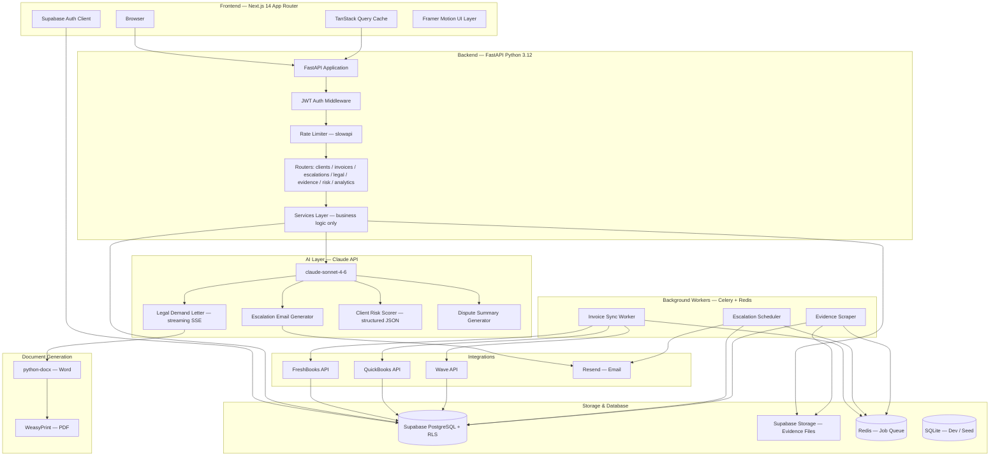
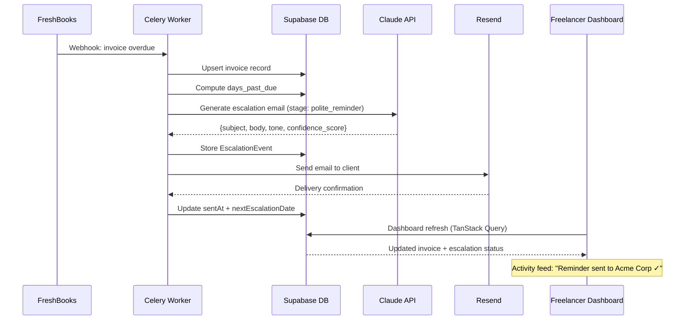

<div align="center">

<h1>🛡️ Freelancer "Bad Cop" CRM</h1>

<p><strong>52 million freelancers get stiffed every year.<br/>We built the bad cop so they don't have to be.</strong></p>

<p>
AI-native payment protection SaaS that automates escalation, drafts jurisdiction-aware legal documents,<br/>
and scores client risk in real time — so you stay the professional while the product does the uncomfortable part.
</p>

<hr/>

<!-- Commit / activity badges -->
<p>
  
  
  
</p>

<!-- Core stack -->
<p>
  
  
  
  
  
</p>

<!-- AI & Data -->
<p>
  
  
  
  
</p>

<!-- Quality gates -->
<p>
  
  
  
  
</p>

<p>
  Built by <strong>Rudrendu Paul</strong> &amp; <strong>Sourav Nandy</strong>
  &nbsp;·&nbsp;
  Developed with <a href="https://claude.ai/code">Claude Code</a>
  &nbsp;·&nbsp;
  Core product shipped in <strong>15 days</strong> with 6 parallel sub-agents
</p>

<p>
  <a href="#the-problem">The Problem</a> &nbsp;·&nbsp;
  <a href="#the-product">The Product</a> &nbsp;·&nbsp;
  <a href="#why-its-sticky">Why It's Sticky</a> &nbsp;·&nbsp;
  <a href="#quick-start">Quick Start</a> &nbsp;·&nbsp;
  <a href="#ai-under-the-hood">AI Features</a> &nbsp;·&nbsp;
  <a href="#architecture">Architecture</a> &nbsp;·&nbsp;
  <a href="#engineering-decisions">Engineering Decisions</a>
</p>

<!--
  📸 DROP SCREENSHOTS HERE
  Recommended dimensions: 1280×800
  1. Dashboard with welcome banner + metric cards + activity feed
  2. Escalation kanban board (5-column pipeline with cards)
  3. Streaming demand letter typewriter effect (GIF preferred)
  4. Client risk breakdown panel

  Save to /docs/screenshots/ and uncomment:
-->
<!--  -->

</div>

---

## The Problem

73 million freelancers in the US. 71% report experiencing late payment. ~52 million people who did the work, delivered the result, and then spent weeks hoping someone would pay.

What makes it uniquely painful is the double bind. Chase softly — the client ignores you. Chase hard — you're "difficult," referrals dry up, the relationship strains. Some clients understand this leverage and use it deliberately. The freelancer absorbs the loss to protect their reputation.

The existing tools don't help. FreshBooks, HoneyBook, HubSpot — they handle invoicing. None of them handle **collection**. There is nothing on the market that combines AI-drafted legal documents, automated escalation sequences, evidence capture, and client risk scoring built specifically for freelancers.

That's the gap. This fills it.

---

## The Product

An AI-native SaaS that plays the **"bad cop"** on behalf of the freelancer. It manages the entire collection process — from a warm first reminder all the way to a jurisdiction-aware legal demand letter and a court-ready evidence export. The freelancer stays the professional who "just uses a billing tool." The product does the uncomfortable part.

Every email, every demand letter, every risk assessment runs through **Claude Sonnet 4.6** — with confidence scores returned to the UI alongside every AI output, so the freelancer sees exactly how the model is reading the situation before they approve and send.

---

## Why It's Sticky

This is not a tool people use once. It earns a place in their regular workflow:

| Habit Loop | How We Enforce It |
|------------|-------------------|
| **Daily dashboard visit** | Personalized urgency banner — "3 invoices need your attention today" — pulls them in |
| **Action before leaving** | "Today's Focus" card surfaces the top 3 actions with one-click CTAs |
| **Celebration on payment** | Confetti + recovery rate update reinforces the positive loop |
| **AI confidence visible** | Every generated email and demand letter shows its confidence score — builds trust, invites engagement |
| **Pipeline view** | Kanban board makes the full collection process feel manageable, not overwhelming |
| **Activity feed** | "Bad Cop sent Final Warning to Acme Corp — $12,500" keeps users informed without requiring manual checks |
| **Risk score animation** | Score counts up from 0 → final number on client detail view — creates a "reveal" moment |
| **Tone-calibrated escalation** | Each stage feels meaningfully different — freelancers learn the system and trust it |

---

## The Escalation Pipeline

Five stages. **Minimum wait times enforced at the engine level** — not in the UI, not as suggestions. A direct API call cannot skip the window. The scheduler will not queue the next stage until the clock has run.

```
Invoice Overdue → Polite Reminder → Firm Notice → Final Warning → Legal Demand → Legal Action
```

| Stage | Days Past Due | Tone | What Claude Generates | Min Wait |
|-------|:------------:|------|----------------------|:--------:|
| **Polite Reminder** | 1–7 | Warm, professional | "Just checking in" email with invoice summary | 7 days |
| **Firm Notice** | 8–14 | Direct | References contract terms, 7-day deadline | 7 days |
| **Final Warning** | 15–21 | Authoritative | Final notice before formal process begins | 5 days |
| **Legal Demand** | 22–30 | Formal, legal | Jurisdiction-aware demand letter PDF | 7 days |
| **Legal Action** | 30+ | Documentation | Small claims prep doc, full evidence summary | — |

---

## AI Under the Hood

Claude isn't a feature here. The product doesn't work without it. Three systems do the actual work:

### Legal Demand Letter Generation

Claude drafts jurisdiction-aware demand letters for California, New York, Texas, England/Wales, and Ontario. Each letter references the exact invoice number, amount, and due date; lists previous contact attempts chronologically; sets a 7-business-day final deadline; and specifies consequences (credit reporting, small claims, collections referral).

Every generated document carries this disclaimer — enforced in the system prompt, verified by the `legal-ai-agent`, non-negotiable:

```
DISCLAIMER: This document was generated with AI assistance and does not
constitute legal advice. Review with a qualified attorney before sending.
```

The letter **streams to the frontend in real time**. The Anthropic Python SDK is synchronous; FastAPI is async. We bridge them with a `threading.Thread` pushing chunks into a `queue.Queue`, then `loop.run_in_executor` pulls from the queue on the async side. The event loop never blocks. The typewriter effect is smooth.

### Client Risk Scoring

Claude scores every client from 0–100 using seven weighted factors: industry payment culture, payment terms length, historical delay average, contract quality, outstanding balance as a percentage of total invoiced, invoice amount relative to client size, and geographic signals. The model returns structured JSON — `{score, level, factors[], reasoning}` — and the UI shows the full factor breakdown with animated progress bars, not just the number.

| Score | Level | Recommendation |
|:-----:|:-----:|----------------|
| 0–25 | 🟢 Low | Standard terms |
| 26–50 | 🟡 Medium | Deposit or milestone payments |
| 51–75 | 🟠 High | 50% upfront before starting |
| 76–100 | 🔴 Critical | Full payment before any work begins |

### Escalation Email Generator

Stage-calibrated drafts with structured output: `{subject, body, tone, confidence_score, key_phrases}`. The **confidence score surfaces in the UI** next to every draft — including a visual progress bar — so freelancers see how certain the model is about the tone calibration before they hit send.

---

## MCP-Powered Development

We used Model Context Protocol servers throughout development. The difference isn't marginal — it's the gap between writing code that guesses at API behavior and writing code validated against live data.

| MCP Server | Role During Development |
|------------|------------------------|
| **Supabase MCP** | Schema queries, migration checks, RLS policy validation — Claude Code read our actual schema before writing a single query |
| **GitHub MCP** | PR creation, diff review, CI status — all from the Claude Code terminal |
| **Gmail MCP** | Built and tested escalation email flows against real email threads; powered the evidence scraper |
| **DocuSign MCP** | Digital signature integration for demand letters with live API validation |
| **QuickBooks MCP** | Real invoice data during integration development — no mocked responses that drift from production |
| **Sequential Thinking MCP** | Used specifically for risk scoring — forces step-by-step reasoning through payment risk factors |

---

## Sub-Agent Architecture

Six specialized sub-agents ran in parallel during development. Each has a specific domain and strict file-system boundaries — which meant the legal AI layer and the frontend pipeline evolved simultaneously without merge conflicts or context collisions.

| Agent | Domain | File Boundaries |
|-------|--------|----------------|
| `legal-ai-agent` | Claude prompt templates, demand letter generation, disclaimer enforcement | `packages/legal-ai/` only |
| `escalation-agent` | Timing engine, tone calibration, stage progression | `apps/api/app/services/escalation_service.py` |
| `integration-agent` | FreshBooks / QuickBooks / Wave OAuth, token refresh, retry | `packages/integrations/` only |
| `risk-scoring-agent` | Risk model, scoring factors, thresholds, synthetic test data | `apps/api/app/services/risk_service.py` |
| `evidence-locker-agent` | Evidence capture, Supabase Storage, signed URLs, court ZIP | `apps/api/app/routers/evidence.py` |
| `test-agent` | pytest unit/integration, Playwright E2E, adversarial legal test cases | `**/tests/` only |

Custom commands in `.claude/commands/`:
```
/new-escalation-template <stage>   — scaffold a new email template + pytest test in one shot
/generate-demand-letter <id>       — generate a demand letter for a specific invoice
/review-pr                         — security + performance + MLP lovability checklist
```

---

## Architecture

### System Overview



### Data Flow: Overdue Invoice → Sent Escalation



---

## Engineering Decisions

**Why Python for the backend, not Node?**
Legal document generation. `python-docx` and `WeasyPrint` give us court-quality PDF output with real template control. The Anthropic Python SDK is the reference implementation. The broader Python ecosystem is stronger for anything legal-adjacent.

**Why centralize all Claude calls in one module?**
`packages/legal-ai/client.py` is the only place the Anthropic SDK is imported. Logging, retries, rate limiting, and model version pinning all happen in one file. It also keeps the `legal-ai-agent`'s scope clean and auditable — no AI calls hiding in routers.

**Why enforce escalation wait times in the engine, not the UI?**
A UI-only guard can be bypassed with a direct API call. The time window check lives in `escalation_service.py` so the rule applies regardless of how the escalation is triggered — dashboard button, API call, or background worker.

**Why SQLite for dev instead of local Postgres?**
No Docker, no install, no credentials. Anyone evaluating this repo runs it in five minutes. SQLAlchemy's dialect system means the ORM layer is identical — only the connection string changes.

**Why Turborepo?**
Frontend (TypeScript) and backend (Python) build in parallel with a shared cache. The monorepo structure enforces clear package boundaries: `packages/legal-ai`, `packages/types`, `packages/integrations` each have a single owner and a single job.

**Why Pydantic Settings with fail-fast validation?**
`settings = Settings()` runs at module import time. If `ANTHROPIC_API_KEY` is missing, the app raises a `ValidationError` before serving a single request. No silent failures in production.

---

## Tech Stack

**Frontend**

Next.js 14 App Router · Tailwind CSS · shadcn/ui · Framer Motion · TanStack Query · Zustand · Zod · Sonner toasts

Framer Motion runs all animations: confetti when a payment lands, the risk score counting from 0 → final with a color shift, the typewriter render of streaming AI text, staggered list animations, hover micro-interactions on every interactive element.

**Backend**

Python 3.12 · FastAPI · SQLAlchemy · Alembic · Pydantic v2 · `python-docx` · `WeasyPrint` · `slowapi`

One service file per domain. No business logic in routers. Each service is independently testable with mocked dependencies.

**Database**

Supabase (PostgreSQL) in production · SQLite via SQLAlchemy for local dev · Alembic manages all schema changes · Row Level Security enforces workspace isolation at the database layer, not the application layer.

**Background Workers**

Celery + Redis. Three workers: invoice sync (FreshBooks/QuickBooks/Wave on webhook + schedule), escalation scheduler (daily check for invoices past the wait window), evidence scraper (captures email threads and attachments).

**Infrastructure**

| Layer | Choice | Why |
|-------|--------|-----|
| Monorepo | Turborepo + pnpm workspaces | Parallel builds, shared cache, clear package boundaries |
| Auth | Supabase JWT + httpOnly cookies + PKCE | PKCE eliminates authorization code interception; httpOnly blocks XSS token theft |
| Rate limiting | slowapi | 100 req/min globally, 10/min on legal doc routes — AI routes are expensive |
| Validation | Zod (FE) + Pydantic v2 (BE) | Same shapes defined twice, in the language each side speaks |
| Email | Resend + React Email | Templates are React components — testable, version-controlled, predictable rendering |

---

## Security

Security was baked in from day one — not bolted on.

| Category | Implementation | Location |
|----------|---------------|----------|
| **Auth** | Supabase JWT, httpOnly cookies, PKCE | `apps/web/middleware.ts` |
| **Authorization** | RLS on every table — workspace isolation at DB layer | `packages/db/migrations/versions/002_rls_policies.sql` |
| **Secrets management** | Pydantic Settings with `SecretStr` — app refuses to start on missing vars | `apps/api/app/config.py` |
| **Input validation** | Pydantic v2 on every endpoint — malformed requests rejected before business logic | `apps/api/app/schemas/` |
| **Rate limiting** | 100 req/min per IP; 10/min on legal doc routes | `apps/api/app/middleware/rate_limit.py` |
| **CORS** | Allowlist-based — no wildcard in production | `apps/api/app/middleware/cors.py` |
| **SQL injection** | SQLAlchemy ORM only — zero raw SQL in the codebase | `apps/api/app/models/` |
| **XSS** | React escaping + strict Content Security Policy | `apps/web/next.config.ts` |
| **API keys** | Never in client bundle — Pydantic Settings, server-side only | `apps/api/app/config.py` |
| **Evidence storage** | Supabase Storage with signed URLs — 1-hour expiry, no public access | `apps/api/app/routers/evidence.py` |
| **Dependency audit** | `safety` + `pip-audit` on every PR; merge blocked on findings | `.github/workflows/security.yml` |
| **SAST** | CodeQL (Python + TypeScript) on every PR | `.github/workflows/security.yml` |

---

## What No Competitor Does

| Capability | Spreadsheets | FreshBooks | HoneyBook | HubSpot | Bad Cop CRM |
|------------|:-----------:|:----------:|:---------:|:-------:|:-----------:|
| AI escalation sequence | Manual | Reminders only | Basic reminders | Manual sequences | Stage-aware, tone-calibrated, confidence-scored |
| Jurisdiction-aware demand letters | ✗ | ✗ | ✗ | ✗ | CA / NY / TX / UK / Ontario · PDF |
| Client risk scoring | ✗ | ✗ | ✗ | ✗ | 0–100 with factor breakdown + AI reasoning |
| Evidence locker + court export | ✗ | ✗ | ✗ | ✗ | Auto-captured, court-ready ZIP download |
| Streaming AI generation | ✗ | ✗ | ✗ | ✗ | Typewriter render, live SSE |
| Invoice sync integrations | Manual | Native | Native | Manual | FreshBooks / QuickBooks / Wave |
| Minimum wait times enforced | N/A | N/A | N/A | N/A | Engine-level — not bypassable via API |

The gap isn't a single missing feature. Invoicing tools don't touch collection. CRMs don't generate legal documents. None of them act as a psychological buffer between the freelancer and their client.

---

## Repository Structure

```
freelancer-payment-protection/
├── apps/
│   ├── web/                          # Next.js 14 App Router
│   │   └── src/
│   │       ├── app/
│   │       │   ├── dashboard/        # Overview: metrics, activity feed, today's focus
│   │       │   ├── clients/          # Client table with risk sort + [id] detail + risk breakdown
│   │       │   ├── invoices/         # Invoice list with filter bar + [id] timeline + evidence locker
│   │       │   ├── escalations/      # 5-column kanban pipeline with stage amounts
│   │       │   └── legal/            # Demand letter generator with streaming preview
│   │       └── components/
│   │           ├── ui/               # shadcn/ui primitives (button, card, dialog, input, select)
│   │           ├── layout/           # SidebarLayout with nav badges + recovery rate widget
│   │           ├── dashboard/        # MetricCard (accent borders, urgency) · ActivityFeed · TodaysFocus · RiskDistributionChart
│   │           ├── clients/          # AddClientDialog
│   │           ├── invoices/         # AddInvoiceDialog
│   │           ├── escalations/      # EscalationCard (urgency ring, flame for critical) · StageColumn (amount at stake)
│   │           ├── legal/            # DisclaimerBanner
│   │           └── shared/           # EmptyState (personality copy) · LoadingSkeleton (shimmer) · RiskBadge (animated) · StatusBadge
│   │
│   ├── api/                          # FastAPI backend (Python 3.12)
│   │   └── app/
│   │       ├── main.py               # App factory + lifespan hooks
│   │       ├── config.py             # Pydantic Settings — fail-fast on missing vars
│   │       ├── database.py           # SQLAlchemy engine + session factory
│   │       ├── routers/              # clients · invoices · escalations · legal_docs · evidence · risk_scoring · analytics · health
│   │       ├── services/             # ai_service · escalation_service · doc_gen_service · risk_service
│   │       ├── middleware/           # auth · rate_limit · cors
│   │       ├── models/               # SQLAlchemy ORM models (client, invoice, escalation, evidence, workspace)
│   │       └── schemas/              # Pydantic request/response schemas (client, invoice, analytics)
│   │
│   └── workers/                      # Celery background workers
│       └── tasks/                    # invoice_sync · reminder_scheduler · evidence_scraper
│
├── packages/
│   ├── db/
│   │   ├── migrations/               # Alembic files — schema lives here, never direct edits
│   │   │   └── versions/
│   │   │       ├── 001_initial_schema.py
│   │   │       └── 002_rls_policies.sql
│   │   ├── models/                   # SQLAlchemy models (canonical source of truth)
│   │   └── seeds/                    # 50 clients, 50 invoices, 20 escalation events — no credentials needed
│   │
│   ├── legal-ai/                     # Central Claude wrapper + all prompt templates
│   │   ├── client.py                 # THE only place Anthropic SDK is imported — enforced in CLAUDE.md
│   │   └── prompts/
│   │       ├── demand_letter.py      # Jurisdiction-aware demand letter prompt
│   │       ├── escalation_sequence.py
│   │       ├── risk_scoring.py       # Structured JSON output: {score, level, factors[], reasoning}
│   │       └── dispute_summary.py
│   │
│   ├── integrations/                 # FreshBooks, QuickBooks, Wave OAuth connectors
│   └── types/                        # Shared TypeScript types (strict — no `any`, enforced by CI)
│
├── .claude/
│   ├── agents/                       # 6 domain-bounded sub-agents (legal-ai, escalation, integration, risk-scoring, evidence-locker, test)
│   └── commands/                     # /new-escalation-template · /generate-demand-letter · /review-pr
│
├── .github/workflows/                # CI: lint → typecheck → test → security audit → PR quality gates
├── legal-templates/                  # Jurisdiction-specific base templates (CA-Ontario, UK-England, US-CA, US-NY)
├── scripts/                          # seed_dev.py + dev utilities
├── CLAUDE.md                         # Architecture spec + security rules + hard coding rules (persists across AI sessions)
└── turbo.json                        # Turborepo pipeline: build, test, lint run in parallel
```

---

## Quick Start

No credentials required. Every feature runs against local SQLite with seed data.

**Prerequisites:** Node.js 20+ · pnpm 9+ · Python 3.12+

```bash
git clone https://github.com/RudrenduPaul/freelancer-payment-protection.git
cd freelancer-payment-protection

# Install JS/TS dependencies (monorepo-wide)
pnpm install

# Copy env files — placeholder values work for local dev
cp apps/api/.env.example apps/api/.env
cp apps/web/.env.example apps/web/.env.local

# Set up Python environment
cd apps/api
pip install -r requirements.txt

# Initialize dev database and load seed data
python -m alembic upgrade head
python scripts/seed_dev.py

cd ../..

# Start everything (frontend + API in parallel via Turborepo)
pnpm dev
```

| Service | URL |
|---------|-----|
| Dashboard | http://localhost:3000 |
| API + OpenAPI docs | http://localhost:8000/docs |

```
Demo credentials
Email:    demo@badcopcr.com
Password: demo123
```

The demo workspace loads 50 mock clients across all four risk levels, 50 invoices across every status, and pre-generated escalation events and evidence items. Walk through the full pipeline without touching any external service.

> **AI features** (demand letter, risk scoring, escalation drafts) require a valid `ANTHROPIC_API_KEY` in `apps/api/.env`. The variable name is in `.env.example`. Never commit real keys.

---

## API Reference

FastAPI generates interactive OpenAPI at `http://localhost:8000/docs`. Key endpoints:

```bash
# Dashboard overview
GET  /api/v1/analytics/overview

# High-risk client list
GET  /api/v1/clients?risk_level=high

# AI-draft the next escalation email (preview before sending)
POST /api/v1/escalations/{id}/draft

# Generate a demand letter (streaming SSE response)
POST /api/v1/legal/demand-letter
     { invoice_id, jurisdiction, client_name, amount, days_past_due }

# AI risk assessment for a client
POST /api/v1/risk/score
     { client_id }

# Court-ready evidence export (ZIP)
GET  /api/v1/evidence/{invoice_id}/export
```

<details>
<summary>Full endpoint surface</summary>

```
GET    /health                           Liveness
GET    /health/ready                     Readiness (DB + Redis)

GET    /api/v1/clients                   List (filter: risk_level, status)
POST   /api/v1/clients                   Create
GET    /api/v1/clients/{id}              Detail
PUT    /api/v1/clients/{id}              Update
DELETE /api/v1/clients/{id}              Soft delete
PATCH  /api/v1/clients/{id}/risk-score   Trigger AI rescore

GET    /api/v1/invoices                  List (filter: status, date range)
POST   /api/v1/invoices                  Create (manual)
GET    /api/v1/invoices/{id}             Detail + escalation timeline
PATCH  /api/v1/invoices/{id}/status      Update status
POST   /api/v1/invoices/sync             Pull from connected integration
GET    /api/v1/invoices/{id}/timeline    Full event history
GET    /api/v1/invoices/{id}/evidence    Evidence items for this invoice

GET    /api/v1/escalations               Active escalations (kanban data)
POST   /api/v1/escalations/{id}/trigger  Advance to next stage
POST   /api/v1/escalations/{id}/draft    AI preview before sending
POST   /api/v1/escalations/{id}/send     Send via Resend
GET    /api/v1/escalations/{id}/history  Full event history

POST   /api/v1/legal/demand-letter       Generate + stream PDF
POST   /api/v1/legal/breach-notice       Generate breach notice
POST   /api/v1/legal/small-claims-prep   Small claims court prep doc
GET    /api/v1/legal/{doc_id}/download   Download (signed URL)

GET    /api/v1/evidence/{invoice_id}           Evidence items
POST   /api/v1/evidence/{invoice_id}/upload    Manual upload
DELETE /api/v1/evidence/{item_id}              Remove
GET    /api/v1/evidence/{invoice_id}/export    Court-ready ZIP

POST   /api/v1/risk/score                AI risk score (structured JSON)
GET    /api/v1/risk/{client_id}/report   Full factor breakdown report
POST   /api/v1/risk/contract-review      Flag payment red flags in contract

GET    /api/v1/analytics/overview                   Dashboard totals + recovery rate
GET    /api/v1/analytics/recovery-trend             Monthly trend (last 12 months)
GET    /api/v1/analytics/overdue-aging              Aging report by days-past-due bucket
GET    /api/v1/analytics/escalation-effectiveness   Recovery rate by stage
```
</details>

---

## Running Tests

```bash
# Backend — pytest with coverage
cd apps/api
pytest --cov=app --cov-report=term-missing

# Frontend — Vitest unit tests
pnpm --filter web test

# E2E — Playwright
pnpm --filter web test:e2e

# Full CI pipeline via Turborepo
pnpm turbo test
```

Coverage gates enforced by CI:
- **70% minimum** line coverage on all PRs
- **90%+** on risk scoring, escalation service, and document generation
- Every new API route: happy path + auth failure + validation error
- No live external API calls in the test suite — everything mocked

---

## Business Model

| Plan | Monthly | Clients | Includes |
|------|:-------:|:-------:|---------|
| **Solo** | $29 | 10 active | Basic escalation sequence, 3 AI legal docs/month, manual evidence upload |
| **Pro** | $59 | Unlimited | Unlimited AI legal docs, evidence locker with court export, full risk scoring, all integrations |
| **Agency** | $99 | Unlimited | Multi-user workspace, white-label client portal, API access, priority support |

Annual pricing: 20% off across all plans.

---

## Roadmap

**V1 (current)** — Invoice tracking · AI escalation sequences · Legal demand letter generation (streaming) · Evidence locker · Client risk scoring · FreshBooks / QuickBooks / Wave integrations · Kanban pipeline · Activity feed

**V2** — Stripe billing · Zapier connector · Mobile PWA · Attorney review marketplace (match demand letters with licensed attorneys by jurisdiction) · Freelancer Collective Defense registry (anonymized shared database of known non-payers)

**V3** — Optional 2% success fee on recovered invoices over $10K · White-label reseller program · Contract analysis at signing time (flag payment risk terms before work begins, not after)

---

## Built in 15 Days

We're **Rudrendu Paul** and **Sourav Nandy**.

We kept watching smart freelancers get burned — by clients who knew exactly how to exploit the politeness trap. The frustrating part isn't that the problem is hard. It's that the solution is obvious and nobody had built it: automate the uncomfortable part, protect the relationship, give the freelancer their time back.

So we built it ourselves — and we used the build as an engineering experiment. *What's actually possible when you treat Claude Code as infrastructure, not a co-pilot?*

The answer: quite a bit.

Six sub-agents with strict domain boundaries meant the legal AI layer and the frontend pipeline evolved in parallel without collisions. MCP servers connected Claude Code directly to our Supabase schema and GitHub during development — every query was written against our actual data, not guesswork. `CLAUDE.md` carried our full architecture spec from session to session — each new conversation picked up exactly where the last one ended.

Fifteen days. Full-stack monorepo. Python backend. Next.js frontend. Six API integrations. Background worker fleet. Streaming AI layer. 50-item seed dataset. Check the commit history.

If you're an investor, engineering lead, or product person evaluating what a small team can actually ship in 2026 — this is that answer.

> *"We didn't use Claude as a writing assistant. We built the entire development environment around it. CLAUDE.md defined our architecture. Six sub-agents had file-system boundaries like engineers on a real team. MCP servers read our live schema so the code was never written against guesses. That's why it behaves predictably in production."*

---

## License

This project is the exclusive intellectual property of **Rudrendu Paul** and **Sourav Nandy**.

Any use — personal, academic, commercial, or otherwise — requires prior written approval from both owners. See [LICENSE](./LICENSE) for full terms.

Contact: [github.com/RudrenduPaul](https://github.com/RudrenduPaul)

---

*Built by Rudrendu Paul and Sourav Nandy — developed with [Claude Code](https://claude.ai/code).*
