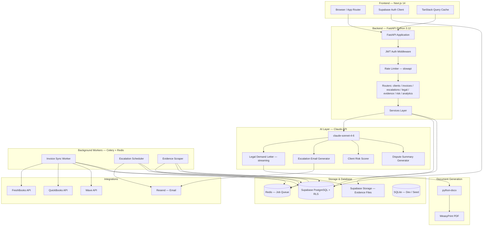
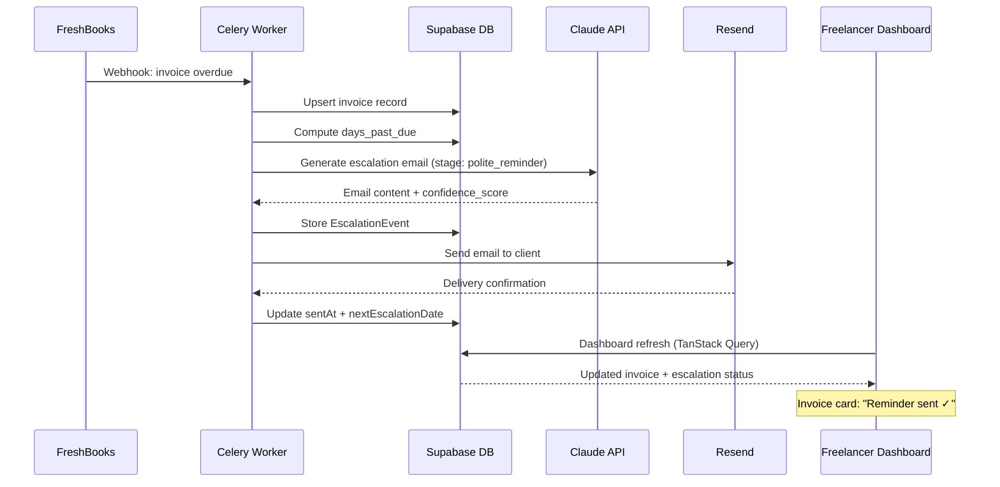

# Freelancer "Bad Cop" CRM

> Stop chasing clients. Let the product do it.


**Built by [Rudrendu Paul](https://github.com/RudrenduPaul) & Sourav Nandy**

---

## The Problem

There are 73 million freelancers in the US. 71% of them report experiencing late payment — that's roughly 52 million people who've done the work, delivered the result, and then spent weeks hoping a client would pay. The number isn't surprising if you've been there.

What makes it uniquely bad is the double bind: chase softly and the client ignores you; chase hard and you're suddenly "difficult to work with." That reputation kills referrals. Some clients seem to know this and exploit it.

The existing tools — FreshBooks, HoneyBook, HubSpot — handle invoicing. None of them handle collection. There's no product in the market that combines AI-drafted legal documents, automated escalation sequences, evidence capture, and client risk scoring specifically built around this one painful workflow.

That's the gap. This is what fills it.

---

## What This Is

An AI-native payment protection SaaS that acts as the "bad cop" on behalf of freelancers. The product manages the entire collection process: from the first polite reminder to a jurisdiction-aware legal demand letter to a court-ready evidence export. The freelancer is always the professional who "just uses a billing tool." The product does the uncomfortable part.

The core technology is an escalation engine backed by Claude (claude-sonnet-4-6). Every email draft, every demand letter, every risk assessment runs through a centralized AI layer with structured prompts, jurisdiction awareness, and confidence scoring returned to the UI alongside every generated document.

---

## The Escalation Pipeline

This is the product's spine. Every overdue invoice moves through five stages, with Claude generating the appropriate communication at each one:

```
Invoice Overdue → Polite Reminder → Firm Notice → Final Warning → Legal Demand → Legal Action
```

| Stage | Days Past Due | Tone | What Claude Generates | Min Wait Before Next |
|-------|:------------:|------|----------------------|:-------------------:|
| **Polite Reminder** | 1–7 | Warm, professional | "Just checking in" email with invoice summary | 7 days |
| **Firm Notice** | 8–14 | Direct | References contract terms, sets a 7-day deadline | 7 days |
| **Final Warning** | 15–21 | Authoritative | Final notice before formal process begins | 5 days |
| **Legal Demand** | 22–30 | Formal, legal | Jurisdiction-aware demand letter PDF | 7 days |
| **Legal Action** | 30+ | Documentation | Small claims prep doc, full evidence summary | — |

The wait times between stages are enforced in the escalation engine — not guidelines, not UI suggestions. The scheduler won't queue the next email until the minimum window has passed.

---

## AI Architecture

Claude is not a feature here. The entire product depends on it. Three AI-driven subsystems carry the weight:

### Legal Demand Letter Generation

Claude drafts jurisdiction-aware demand letters for five jurisdictions: California, New York, Texas, England/Wales, and Ontario. Each letter references the exact invoice number, amount, and due date; lists previous contact attempts chronologically; states a 7-business-day final deadline; and specifies consequences (credit reporting, small claims, collections referral). Every generated document gets the disclaimer at the top:

```
DISCLAIMER: This document was generated with AI assistance and does not
constitute legal advice. Review with a qualified attorney before sending.
```

This isn't optional. It's enforced in the system prompt and verified in the agent's hard rules — the legal-ai-agent refuses to generate documents without it.

The letter streams to the frontend in real time. The implementation is worth explaining: the Anthropic Python SDK is synchronous, but FastAPI is async. We bridge them with a `threading.Thread` pushing chunks into a `queue.Queue`, then `loop.run_in_executor` pulls from that queue on the async side. It's not the prettiest pattern, but it's correct — the event loop never blocks, and the typewriter effect in the UI is smooth.

### Client Risk Scoring

Claude scores every client from 0 to 100 using seven weighted factors: industry payment culture, payment terms length, historical delay average, contract quality, outstanding balance as a percentage of total invoiced, invoice amount relative to client size, and geographic signals. The model returns structured JSON — `{score, level, factors[], reasoning}` — and the UI shows the full factor breakdown, not just the number. A score isn't useful if you don't know what drove it.

| Score | Level | Meaning |
|:-----:|:-----:|---------|
| 0–25 | Low | Standard terms are fine |
| 26–50 | Medium | Deposit or milestone payments worth considering |
| 51–75 | High | 50% upfront before starting |
| 76–100 | Critical | Full payment before any work begins |

### Escalation Email Generator

Stage-calibrated drafts with structured output: `{subject, body, tone, confidence_score, key_phrases}`. The confidence score surfaces in the UI next to every AI-generated draft. Freelancers can see how confident the model is in the tone calibration before they approve and send.

---

## MCP Strategy

This project uses Model Context Protocol servers during development, which changes how Claude Code interacts with the codebase — from writing code that guesses at API behavior to writing code validated against live data.

| MCP Server | Role During Development |
|------------|------------------------|
| **Supabase MCP** | Schema queries, migration checks, RLS policy validation in natural language during dev sessions |
| **GitHub MCP** | PR creation, diff review, CI status — all from the Claude Code terminal without context switching |
| **Gmail MCP** | Build and test the escalation email flows against real email threads; powers the evidence scraper during development |
| **DocuSign MCP** | Wire up digital signature for demand letters; live validation during the legal doc feature build |
| **QuickBooks MCP** | Real invoice data during integration development — no mocking API responses that may drift from reality |
| **Sequential Thinking MCP** | Used specifically for the risk scoring feature — forces step-by-step reasoning through payment risk factors before a score is generated |

The practical difference is significant. With Supabase MCP, Claude Code reads the actual schema before writing a query. With Gmail MCP, the evidence scraper is tested against real threads, not fabricated fixtures. Every external call in this codebase was validated against the live API before it shipped.

---

## Sub-Agent Architecture

Six specialized sub-agents run in parallel during development, each with a distinct domain and strict file-system boundaries:

| Agent | Domain | Strict Boundaries |
|-------|--------|-------------------|
| `legal-ai-agent` | All Claude prompt templates, demand letter generation, disclaimer enforcement | Writes to `packages/legal-ai/` only |
| `escalation-agent` | Escalation timing engine, tone calibration, stage progression rules, email sequence quality | Owns `apps/api/app/services/escalation_service.py` |
| `integration-agent` | FreshBooks / QuickBooks / Wave OAuth connectors, token refresh, retry logic | Writes to `packages/integrations/` only |
| `risk-scoring-agent` | Risk model design, scoring factors, thresholds, synthetic test data generation | Owns `apps/api/app/services/risk_service.py` |
| `evidence-locker-agent` | Evidence capture pipeline, Supabase Storage, signed URL management, court-ready ZIP export | Owns `apps/api/app/routers/evidence.py` |
| `test-agent` | pytest unit/integration tests, Playwright E2E, coverage gates, adversarial test cases for legal features | Writes to `**/tests/` directories only |

Custom commands in `.claude/commands/`:
- `/new-escalation-template <stage>` — scaffolds a new escalation email template and its pytest test in one shot
- `/generate-demand-letter <invoice_id>` — generates a demand letter for a specific invoice
- `/review-pr` — runs the security + performance + MLP lovability checklist before any PR merges

---

## Tech Stack

**Frontend**

Next.js 14 App Router with Tailwind CSS and shadcn/ui. Server Components handle data-heavy pages (the escalation kanban, the evidence locker) without client-side fetching overhead. Framer Motion handles all animations — confetti on payment collection, the risk score count-up from 0 to the final score with a color transition, the typewriter render of streaming AI text. TanStack Query manages server state with optimistic updates; Zustand handles local UI state.

**Backend**

Python 3.12 with FastAPI. The Python choice is deliberate: python-docx and WeasyPrint for document generation, the Anthropic SDK for AI calls, and the broader Python ecosystem for anything legal-adjacent. The services layer is clean — one file per concern, no business logic in routers.

**Database**

Supabase (PostgreSQL) in production. SQLite via SQLAlchemy for local development — identical schema, no credentials required. Alembic manages migrations; schema changes go through migration files, never direct edits. Row Level Security enforces workspace isolation at the database layer, not just the application layer.

**AI**

All Claude calls route through `packages/legal-ai/client.py`. Nothing calls the Anthropic SDK directly from routers, workers, or tests. This is enforced in `CLAUDE.md` and verified in code review by the legal-ai-agent. The centralized wrapper handles both synchronous and streaming calls, with the async/sync bridge handled via thread pool + `asyncio.run_in_executor`.

**Background Workers**

Celery + Redis. Three workers: invoice sync (pulls from FreshBooks/QuickBooks/Wave on a schedule and on webhook triggers), escalation scheduler (checks daily for invoices that have passed the wait window and queues the next stage), and evidence scraper (captures and stores email threads and uploaded attachments as they arrive).

**Infrastructure choices in brief:**

| Layer | Choice | The actual reason |
|-------|--------|-------------------|
| Monorepo | Turborepo + pnpm workspaces | Parallel builds with shared cache; the frontend and Python backend can build simultaneously without a custom Makefile |
| Auth | Supabase JWT + httpOnly cookies + PKCE | PKCE eliminates authorization code interception; httpOnly blocks XSS from touching the token |
| Rate limiting | slowapi | 100 req/min globally, 10/min on legal doc routes — the AI routes are expensive and need separate throttling |
| Validation | Zod (frontend) + Pydantic v2 (backend) | The same data shapes defined twice, in the language each side speaks natively, with compile-time checking on both ends |
| Email | Resend + React Email | Templates are React components — testable, version-controlled, and the rendering is predictable across clients |

---

## System Architecture



### Data Flow: Overdue Invoice to Sent Escalation



---

## Security

Security is in from day one — not something we planned to add later.

| Category | What We Built | Where to Find It |
|----------|--------------|-----------------|
| **Auth** | Supabase JWT, httpOnly cookies, PKCE flow | `apps/web/middleware.ts` |
| **Authorization** | Row Level Security on every table — workspace isolation at the DB layer, not app layer | `packages/db/migrations/versions/002_rls_policies.sql` |
| **Secrets management** | Pydantic Settings with `SecretStr` — app refuses to start if any required var is missing | `apps/api/app/config.py` |
| **Input validation** | Pydantic v2 on every FastAPI endpoint — malformed requests rejected before they hit business logic | `apps/api/app/schemas/` |
| **Rate limiting** | 100 req/min per IP; 10/min on legal doc generation routes (AI routes are expensive) | `apps/api/app/middleware/rate_limit.py` |
| **CORS** | Allowlist-based — no wildcard in production | `apps/api/app/middleware/cors.py` |
| **SQL injection** | SQLAlchemy ORM only — no raw SQL anywhere in the codebase | `apps/api/app/models/` |
| **XSS** | React's built-in escaping + strict Content Security Policy headers | `apps/web/next.config.ts` |
| **API key handling** | Never in the client bundle; loaded from environment via Pydantic Settings on the server | `apps/api/app/config.py` |
| **Evidence storage** | Supabase Storage with signed URLs — 1-hour expiry, no public access | `apps/api/app/routers/evidence.py` |
| **Dependency audit** | `safety` + `pip-audit` scan on every PR; merge blocked on findings | `.github/workflows/security.yml` |
| **SAST** | CodeQL scanning (Python + TypeScript) on every PR | `.github/workflows/security.yml` |

The fail-fast pattern in `config.py` is worth noting: `settings = Settings()` runs at module import time. If `ANTHROPIC_API_KEY` or any other required variable is absent, the app raises a `ValidationError` before serving a single request. No silent failures, no runtime surprises.

---

## Repository Structure

```
freelancer-payment-protection/
├── apps/
│   ├── web/                          # Next.js 14 App Router
│   │   └── src/
│   │       ├── app/
│   │       │   ├── (auth)/           # Login, signup, onboarding
│   │       │   ├── dashboard/        # Overview metrics
│   │       │   ├── clients/          # Client table + risk scores + [id] detail
│   │       │   ├── invoices/         # Invoice list + overdue alerts + [id] timeline
│   │       │   ├── escalations/      # 5-column kanban pipeline
│   │       │   ├── legal/            # Demand letter generation + streaming preview
│   │       │   └── api/              # Next.js BFF routes
│   │       └── components/
│   │           ├── ui/               # shadcn/ui primitives
│   │           ├── clients/          # ClientCard, RiskScoreBadge, ClientDetailPanel
│   │           ├── invoices/         # InvoiceRow, OverdueAlertPulse, EscalationTimeline
│   │           ├── escalations/      # EscalationPipeline, DemandLetterPreview
│   │           ├── evidence/         # EvidenceLocker, EvidenceUpload
│   │           ├── analytics/        # RecoveryRateChart, OverdueTrendChart, RiskDistributionPie
│   │           ├── dashboard/        # MetricCard, RiskDistributionChart
│   │           └── shared/           # EmptyState, LoadingSkeleton, StreamingText, ConfettiCelebration
│   │
│   ├── api/                          # FastAPI backend (Python 3.12)
│   │   └── app/
│   │       ├── main.py               # App factory + lifespan
│   │       ├── config.py             # Pydantic Settings — fail-fast env validation
│   │       ├── database.py           # SQLAlchemy engine + session factory
│   │       ├── routers/              # clients, invoices, escalations, legal_docs, evidence, risk_scoring, analytics, health
│   │       ├── services/             # ai_service, escalation_service, doc_gen_service, risk_service
│   │       ├── middleware/           # auth, rate_limit, cors
│   │       ├── models/               # SQLAlchemy ORM models
│   │       └── schemas/              # Pydantic request/response schemas
│   │
│   └── workers/                      # Celery background workers
│       └── tasks/                    # invoice_sync, reminder_scheduler, evidence_scraper
│
├── packages/
│   ├── db/
│   │   ├── migrations/               # Alembic migration files (schema lives here)
│   │   │   └── versions/
│   │   │       ├── 001_initial_schema.py
│   │   │       └── 002_rls_policies.sql
│   │   ├── models/                   # SQLAlchemy models (client, invoice, escalation, evidence, workspace)
│   │   └── seeds/                    # 50 clients, 50 invoices, 20 escalation events — no credentials needed
│   │
│   ├── legal-ai/                     # Central Claude wrapper + all prompt templates
│   │   ├── client.py                 # THE only place Anthropic SDK is called
│   │   └── prompts/
│   │       ├── demand_letter.py      # Jurisdiction-aware demand letter prompt
│   │       ├── escalation_sequence.py
│   │       ├── risk_scoring.py       # Structured JSON output — {score, level, factors[], reasoning}
│   │       └── dispute_summary.py
│   │
│   ├── doc-gen/                      # python-docx + WeasyPrint PDF pipeline
│   ├── integrations/                 # FreshBooks, QuickBooks, Wave OAuth connectors
│   └── types/                        # Shared TypeScript types (no `any` — enforced by CI)
│
├── .claude/
│   ├── agents/                       # 6 specialized sub-agents (one per domain)
│   └── commands/                     # /new-escalation-template, /generate-demand-letter, /review-pr
│
├── .github/workflows/                # CI (lint → typecheck → test), security audit, PR quality gates
├── legal-templates/                  # Jurisdiction-specific base templates for demand letters
└── scripts/                          # seed_db.py and dev utilities
```

---

## Getting Started

No credentials required. Every feature runs against local SQLite with seed data.

### Prerequisites

- Node.js 20+
- pnpm 9+
- Python 3.12+
- Redis (only needed if you want to run the background workers)

### 5-minute setup

```bash
git clone https://github.com/RudrenduPaul/freelancer-payment-protection.git
cd freelancer-payment-protection

# Install JS/TS dependencies across the monorepo
pnpm install

# Copy env files — placeholder values work for local dev
cp apps/api/.env.example apps/api/.env
cp apps/web/.env.example apps/web/.env.local

# Set up Python
cd apps/api
pip install -r requirements.txt

# Initialize the SQLite dev database and load seed data
python -m alembic upgrade head
python scripts/seed_db.py

cd ../..

# Start everything
pnpm dev
```

- **Dashboard:** http://localhost:3000
- **API + interactive docs:** http://localhost:8000/docs

```
Demo login
Email:    demo@badcopcr.com
Password: demo123
```

The demo workspace has 50 mock clients (spread across all four risk levels), 50 invoices across every status, and pre-generated escalation events and evidence items. You can walk through the full escalation pipeline and see risk score reveals without touching any external service.

> To use the AI features (demand letter generation, risk scoring, escalation email drafts), add a valid `ANTHROPIC_API_KEY` to `apps/api/.env`. The variable name is in `.env.example`. Never commit real keys.

---

## API Reference

FastAPI generates an interactive OpenAPI spec at `http://localhost:8000/docs` when running locally. A quick tour of the surface:

```bash
# High-risk client list
GET  /api/v1/clients?risk_level=high

# AI-draft the next escalation email (preview before sending)
POST /api/v1/escalations/{id}/draft

# Generate a demand letter
POST /api/v1/legal/demand-letter
     { invoice_id, jurisdiction, client_name, amount, days_past_due }

# AI risk assessment for a client
POST /api/v1/risk/score
     { client_id }

# Court-ready evidence export
GET  /api/v1/evidence/{invoice_id}/export
```

Full endpoint surface:

```
GET    /health                           Liveness
GET    /health/ready                     Readiness (DB + Redis)

GET    /api/v1/clients                   List (filter: risk_level, status)
POST   /api/v1/clients                   Create
GET    /api/v1/clients/{id}             Detail
PUT    /api/v1/clients/{id}             Update
DELETE /api/v1/clients/{id}             Soft delete
PATCH  /api/v1/clients/{id}/risk-score  Trigger AI rescore

GET    /api/v1/invoices                  List (filter: status, date range)
POST   /api/v1/invoices                  Create (manual)
GET    /api/v1/invoices/{id}            Detail + escalation timeline
PATCH  /api/v1/invoices/{id}/status     Update status
POST   /api/v1/invoices/sync            Pull from connected integration
GET    /api/v1/invoices/{id}/timeline   Full event history

GET    /api/v1/escalations              Active escalations
POST   /api/v1/escalations/{id}/trigger Next stage
POST   /api/v1/escalations/{id}/draft   AI preview (before sending)
POST   /api/v1/escalations/{id}/send    Send via Resend
GET    /api/v1/escalations/{id}/history Full history

POST   /api/v1/legal/demand-letter      Generate PDF
POST   /api/v1/legal/breach-notice      Generate PDF
POST   /api/v1/legal/small-claims-prep  Generate PDF
GET    /api/v1/legal/{doc_id}/download  Download (signed URL)

GET    /api/v1/evidence/{invoice_id}    Evidence items
POST   /api/v1/evidence/{invoice_id}/upload  Manual upload
DELETE /api/v1/evidence/{item_id}       Remove
GET    /api/v1/evidence/{invoice_id}/export  Court-ready ZIP

POST   /api/v1/risk/score               Compute risk score
GET    /api/v1/risk/{client_id}/report  Full assessment report
POST   /api/v1/risk/contract-review     Flag payment red flags in a contract

GET    /api/v1/analytics/overview            Dashboard totals + recovery rate
GET    /api/v1/analytics/recovery-trend      Monthly (last 12 months)
GET    /api/v1/analytics/overdue-aging       Aging report by days-past-due bucket
GET    /api/v1/analytics/escalation-effectiveness  Recovery rate by stage
```

---

## Key Design Decisions

A few non-obvious choices worth explaining:

**Why Python for the backend, not Node?**
Legal document generation. The Python ecosystem — python-docx, WeasyPrint, and the Anthropic SDK — made the document pipeline straightforward. Trying to generate court-ready PDFs from a Node backend would have required either headless Chrome or a library with significantly worse template control.

**Why SQLite for dev instead of a local Postgres?**
To lower the barrier to entry for anyone evaluating the repository. No Docker, no Postgres install, no credentials. SQLAlchemy's dialect system means the ORM layer is identical across SQLite and Postgres — the only difference is the connection string in the env file.

**Why centralize all Claude calls in one module?**
`packages/legal-ai/client.py` is the only place the Anthropic SDK is imported. This makes it easy to add logging, rate limiting, retries, and model version changes in one place without hunting across the codebase. It also makes the legal-ai-agent's scope unambiguous.

**Why the async/sync bridge for streaming?**
FastAPI is async. The Anthropic Python SDK is synchronous. Running a blocking SDK call on the async event loop would stall all concurrent requests. The solution: a `threading.Thread` runs the synchronous streaming call and pushes text chunks into a `queue.Queue`; `loop.run_in_executor` pulls from the queue on the async side. Not elegant, but correct — the event loop stays unblocked.

**Why enforce minimum wait times between escalation stages in the engine, not the UI?**
A UI-only guard can be bypassed by a direct API call. Putting the time window check in the escalation service means the rule applies regardless of how the escalation is triggered — dashboard button, API call, or background worker.

---

## What No Competitor Offers

| Capability | Spreadsheets | FreshBooks | HoneyBook | HubSpot | Bad Cop CRM |
|------------|:-----------:|:----------:|:---------:|:-------:|:-----------:|
| AI escalation sequence | Manual | Reminders only | Basic reminders | Manual sequences | Stage-aware, tone-calibrated |
| Jurisdiction-aware demand letters | No | No | No | No | CA / NY / TX / UK / Ontario |
| Client risk scoring | No | No | No | No | 0–100 with factor breakdown |
| Evidence locker + court export | No | No | No | No | Auto-captured, ZIP download |
| Streaming AI generation (typewriter) | No | No | No | No | Yes |
| Invoice sync integrations | Manual | Native | Native | Manual | FreshBooks / QuickBooks / Wave |
| Minimum wait times between stages | N/A | N/A | N/A | N/A | Enforced in engine |

The gap isn't one feature — it's the combination. Invoicing tools don't touch collection. CRMs don't generate legal documents. And none of them act as a psychological buffer between the freelancer and their client.

---

## Business Model

| Plan | Monthly | Clients | What's Included |
|------|:-------:|:-------:|----------------|
| **Solo** | $29 | 10 active | Basic escalation sequence, 3 AI legal docs/month, manual evidence upload |
| **Pro** | $59 | Unlimited | Unlimited AI legal docs, evidence locker with court export, full risk scoring, all integrations |
| **Agency** | $99 | Unlimited | Multi-user workspace, white-label client portal, API access, priority support |

Annual pricing: 20% off across all plans.

---

## Roadmap

**V1 (current):** Invoice tracking, AI escalation sequences, legal demand letter generation, evidence locker, client risk scoring, FreshBooks / QuickBooks / Wave integrations.

**V2:** Stripe billing, Zapier connector, mobile PWA, attorney review marketplace (match demand letters with licensed attorneys by jurisdiction), Freelancer Collective Defense registry (anonymized shared database of known non-payers — every new user contributes to and benefits from it).

**V3:** Optional 2% success fee on recovered invoices over $10K, white-label reseller program, contract analysis at signing time (flag payment risk terms before work begins, not after it's done).

---

## Running Tests

```bash
# Backend — pytest with coverage
cd apps/api
pytest --cov=app --cov-report=term-missing

# Frontend — Vitest
pnpm --filter web test

# E2E — Playwright
pnpm --filter web test:e2e

# Full CI pipeline via Turborepo
pnpm turbo test
```

Coverage requirements enforced by CI:
- 70% minimum line coverage on all PRs (`--cov-fail-under=70`)
- 90%+ on risk scoring, escalation service, and document generation
- Every new API route: happy path + auth failure + validation error test
- No live external API calls in the test suite — everything mocked

---

## About the Builders

**Rudrendu Paul** and **Sourav Nandy** built the Freelancer Bad Cop CRM as an accelerator-ready engineering showcase. The goal was to demonstrate what a small, technically capable team can ship when the AI layer is treated as infrastructure rather than a feature.

We built the core product — escalation engine, AI demand letter generation, evidence locker, risk scoring — in 15 days using Claude Code with six sub-agents running in parallel. Each sub-agent had a specific domain and file-system boundary, which meant we could work on the legal AI layer and the frontend pipeline simultaneously without merge conflicts or context collisions. The CLAUDE.md file carried our entire architecture and coding standards from session to session — every new conversation picked up exactly where the last one ended.

The honest take on the development process: without Claude Code, a two-person team building a full-stack monorepo with a Python backend, a Next.js frontend, six API integrations, background workers, and a streaming AI layer would have taken eight to ten weeks. We shipped a reviewable, deployable version in fifteen days. That's not a marketing claim — it's what the commit history shows.

The decision to build in public (as a showcase repo with seed data and no credential requirements) was intentional. We wanted anyone evaluating the code to be able to run it in five minutes and see the full product working, not a demo video.

> "We used Claude Code as our primary development environment. The `CLAUDE.md` defines our architecture and coding standards. Six sub-agents ran in parallel. MCP servers connected Claude Code directly to our Supabase schema and GitHub during development, so every query and migration was validated against our actual data. The result is code that behaves predictably in production because it was never written against guesses."

---

## License

This project is the exclusive intellectual property of **Rudrendu Paul** and **Sourav Nandy**.

Any use — personal, academic, commercial, or otherwise — requires prior written approval from both owners. See [LICENSE](./LICENSE) for the full terms.

Contact: [github.com/RudrenduPaul](https://github.com/RudrenduPaul)

---

*Built by Rudrendu Paul and Sourav Nandy — developed with [Claude Code](https://claude.ai/code).*
