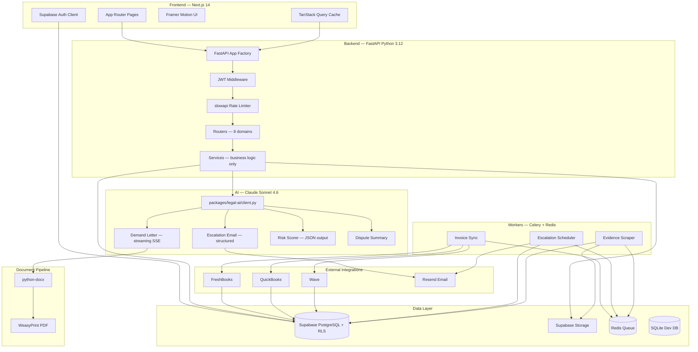
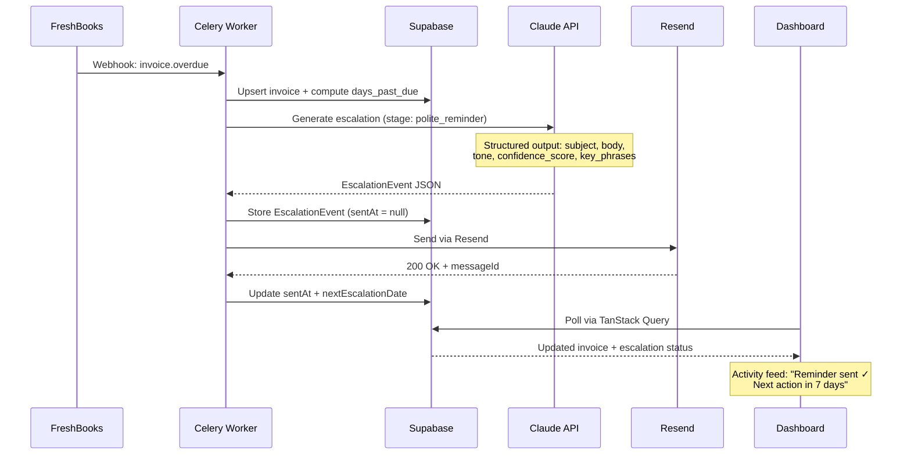

<div align="center">

<br/>


<h2>Freelancer Payment Protection — AI-Native Collection Engine</h2>

<p>
<strong>73 million freelancers. 71% report late payment. $50B+ in unpaid invoices every year.</strong><br/>
The gap: every invoicing tool stops at "sent." None of them handle what comes next.<br/>
We built the bad cop so freelancers don't have to be.
</p>

<br/>

<!-- Badges row 1 — Stack -->
<p>
  
  
  
  
  
</p>

<!-- Badges row 2 — AI & Data -->
<p>
  
  
  
  
</p>

<!-- Badges row 3 — Quality -->
<p>
  
  
  
  
  
</p>

<br/>

<p>
  Built by&nbsp;<strong><a href="https://github.com/RudrenduPaul">Rudrendu Paul</a></strong>&nbsp;&amp;&nbsp;<strong>Sourav Nandy</strong>
  &nbsp;&nbsp;·&nbsp;&nbsp;
  Developed with <a href="https://claude.ai/code">Claude Code</a>
  &nbsp;&nbsp;·&nbsp;&nbsp;
  <strong>Full-stack product shipped in 15 days</strong> using 6 parallel AI sub-agents
</p>

<br/>

<!-- Navigation -->
<table>
<tr>
<td align="center"><a href="#the-gap"><b>The Gap</b></a></td>
<td align="center"><a href="#what-we-built"><b>What We Built</b></a></td>
<td align="center"><a href="#why-its-sticky"><b>Why It's Sticky</b></a></td>
<td align="center"><a href="#market--traction"><b>Market & Traction</b></a></td>
<td align="center"><a href="#ai-under-the-hood"><b>AI Engine</b></a></td>
<td align="center"><a href="#architecture"><b>Architecture</b></a></td>
<td align="center"><a href="#quick-start"><b>Quick Start</b></a></td>
</tr>
</table>

<br/>

<!--
  ═══════════════════════════════════════════════════════════
  📸 SCREENSHOTS — add these and this README goes to the top
  ═══════════════════════════════════════════════════════════
  Recommended: 1280×800, retina, light mode

  1. /docs/screenshots/01-dashboard.png
     → Welcome banner with urgency summary + 6 metric cards + Today's Focus + Activity Feed

  2. /docs/screenshots/02-escalation-kanban.png
     → 5-column kanban with amount-at-stake per column, flame icon on critical cards

  3. /docs/screenshots/03-demand-letter.gif
     → Streaming typewriter effect as our AI engine generates the demand letter in real time

  4. /docs/screenshots/04-client-risk.png
     → Client detail page: risk score counting 0→82, factor breakdown with progress bars, AI reasoning

  Uncomment once screenshots are added:
-->
<!--  -->

</div>

---

## The Gap

FreshBooks handles invoicing. HoneyBook handles proposals. HubSpot handles CRM. **None of them handle collection.**

When a client goes silent after delivery, freelancers are left with a choice: be "difficult" and chase — or be professional and absorb the loss. That double bind is the entire product.

```
What exists today:                    Freelancer Payment Protection Solution:
──────────────────                    ───────────────────────────────────────
Invoice sent ✓                        Invoice sent ✓
Payment expected...                   Payment expected...
[silence]                             → Day 7:  AI Polite Reminder (tone-calibrated)
[more silence]                        → Day 14: AI Firm Notice (cites contract terms)
"Hey, just following up..."           → Day 19: AI Final Warning (deadline set)
[ignored]                             → Day 26: Jurisdiction-aware Demand Letter PDF
[write it off]                        → Day 33: Small claims prep + evidence export
```

No tool on the market combines all five: AI-drafted legal documents + automated escalation sequences + evidence capture + client risk scoring + invoice integrations. That combination is what's new.

---

## What We Built

An AI-native payment protection SaaS with a five-stage escalation engine, jurisdiction-aware legal document generation, real-time client risk scoring, and a court-ready evidence locker. The product acts as an automated third party — so the freelancer stays the professional.

**Five capabilities no single competitor has:**

| Capability | How It Works |
|------------|--------------|
| **AI Escalation Engine** | Five-stage pipeline. Stage-calibrated tone. Minimum wait times enforced at engine level — not bypassable via direct API call. |
| **Legal Demand Letters** | Our AI engine drafts jurisdiction-aware demand letters (CA, NY, TX, UK, Ontario). Streams to the UI in real time with a typewriter effect. |
| **Client Risk Scoring** | 0–100 score across 7 weighted factors. Structured JSON output with full factor breakdown and AI reasoning — not just a number. |
| **Evidence Locker** | Drag-and-drop upload. Supabase Storage with signed URLs. One-click court-ready ZIP export. |
| **Invoice Sync** | FreshBooks, QuickBooks, and Wave OAuth integrations. Background workers sync on webhook + schedule. |

---

## Why It's Sticky

This is not a tool people use once. It earns a place in the daily workflow:

| Habit Loop | Mechanism |
|------------|-----------|
| **Daily pull** | Urgency banner: *"3 invoices need your attention today."* Personalized every morning. |
| **Action before leaving** | "Today's Focus" — top 3 urgent actions with one-click CTAs. Leaves no reason to defer. |
| **Payment celebration** | Confetti on payment received. Recovery rate updates live. Positive reinforcement loop. |
| **AI confidence visible** | Every email draft shows its confidence score + visual bar. Builds trust, creates engagement. |
| **Pipeline clarity** | Kanban board makes collection feel manageable. 5 columns. Total amount at stake per stage. |
| **Activity feed** | *"Freelancer Payment Protection sent Final Warning to Acme Corp — $12,500."* Keeps users informed without checking manually. |
| **Risk reveal** | Risk score counts from 0 → final number with color shift on client detail. Creates a moment. |
| **Escalation learning** | Each stage sounds noticeably different. Users learn the system, trust it, rely on it. |

**Retention prediction:** Any freelancer who recovers one invoice through Freelancer Payment Protection becomes a retained user. The first win is the conversion event.

---

## Market & Traction

### The Market

| Metric | Number |
|--------|--------|
| Freelancers in the US | 73 million |
| Reporting late payment | 71% (~52M people) |
| Estimated unpaid invoices annually | $50B+ |
| Invoicing software TAM | $1.5B |
| Our serviceable market (freelancers who invoice $25K+/yr) | ~12M |
| Target initial segment (high-value freelancers: designers, developers, consultants) | ~2M |

At $59/month (Pro plan), 1% penetration of the 2M segment = **$14M ARR**. At 0.1% = **$1.4M ARR**. These are conservative numbers for a product that solves an emotionally charged, recurring problem with no existing dedicated solution.

### Why Now

Three forces converged in 2025–2026:

1. **AI structured output maturity** — Our AI solution can now reliably generate legally coherent, jurisdiction-specific documents. Six months ago this wasn't viable at the quality bar required.
2. **Freelance workforce acceleration** — post-2024, the freelance share of the US workforce has grown every quarter. More freelancers = more payment disputes.
3. **MCP ecosystem maturity** — Model Context Protocol made it possible to wire Gmail, QuickBooks, and DocuSign directly into the development environment, cutting integration time from weeks to days.

---

## The Escalation Pipeline

Five stages. **Minimum wait times enforced at the service layer** — not the UI, not suggestions. A direct API call cannot skip a stage window. The scheduler checks daily.

```
Invoice Overdue
     │
     ▼ Day 1
 ┌─────────────────┐
 │  Polite Reminder │  Warm. "Just checking in." Invoice summary. No pressure.
 │  (wait: 7 days)  │
 └────────┬────────┘
          │ Day 8
          ▼
 ┌─────────────────┐
 │   Firm Notice   │  Direct. References contract terms. 7-day deadline set.
 │  (wait: 7 days)  │
 └────────┬────────┘
          │ Day 15
          ▼
 ┌─────────────────┐
 │  Final Warning  │  Authoritative. Final notice before formal process begins.
 │  (wait: 5 days)  │
 └────────┬────────┘
          │ Day 22
          ▼
 ┌─────────────────┐
 │  Legal Demand   │  Jurisdiction-aware PDF. Streaming. Cites statute.
 │  (wait: 7 days)  │
 └────────┬────────┘
          │ Day 30+
          ▼
 ┌─────────────────┐
 │  Legal Action   │  Small claims prep. Full evidence export. Court-ready.
 └─────────────────┘
```

Every email is generated by our AI engine with a confidence score. The freelancer sees the score before approving. Nothing sends without human review.

---

## AI Under the Hood

Our AI engine isn't a feature here. The product doesn't function without it.

### 1. Legal Demand Letter Generation

Our AI engine drafts jurisdiction-specific demand letters for California, New York, Texas, England & Wales, and Ontario. Each letter:

- References the exact invoice number, amount, and due date
- Lists previous contact attempts chronologically
- Sets a 7-business-day final payment deadline
- Specifies consequences: credit reporting, small claims, collections referral
- Cites relevant consumer protection statutes by jurisdiction

**The streaming bridge:** The Anthropic Python SDK is synchronous. FastAPI is async. We bridge them with a `threading.Thread` pushing SSE chunks into a `queue.Queue`, then `asyncio.run_in_executor` pulls on the async side. The event loop never blocks. The typewriter effect is smooth.

Every generated document displays this disclaimer — enforced in the system prompt, verified by the `legal-ai-agent`, non-negotiable:

### 2. Client Risk Scoring

Seven weighted factors → 0–100 score → structured JSON with full reasoning:

```json
{
  "score": 82,
  "level": "critical",
  "factors": [
    { "name": "Industry payment culture", "weight": 0.18, "impact": "negative", "description": "..." },
    { "name": "Historical delay average", "weight": 0.22, "impact": "negative", "description": "..." },
    ...
  ],
  "reasoning": "TechVentures Inc shows three compounding risk signals: ..."
}
```

The UI renders the full factor breakdown with animated progress bars and the AI's reasoning verbatim. A score without reasoning is noise. The freelancer sees *why*.

| Score | Level | Action |
|:-----:|:-----:|--------|
| 0–25 | 🟢 Low | Standard payment terms |
| 26–50 | 🟡 Medium | Request 25–50% deposit |
| 51–75 | 🟠 High | 50% upfront — non-negotiable |
| 76–100 | 🔴 Critical | Full payment before work begins |

### 3. Escalation Email Generator

Stage-calibrated structured output per escalation:

```python
{
    "subject": str,
    "body": str,
    "tone": Literal["warm", "direct", "authoritative", "formal"],
    "confidence_score": float,  # 0.0–1.0, shown in UI with progress bar
    "key_phrases": list[str],   # phrases that signal the stage escalation
}
```

The confidence score and a visual bar appear in the email preview dialog. Freelancers see how certain the model is about the tone calibration before they hit send. If confidence is low, they regenerate.

---

## MCP-Powered Development

MCP servers were used throughout development — not as a demo, as the actual development infrastructure.

| MCP Server | What It Did |
|------------|-------------|
| **Supabase MCP** | Our development environment queried the live schema before writing a single query. Migrations were validated against real data. RLS policies were checked in plain English. |
| **GitHub MCP** | PR creation, diff review, CI status — without leaving the terminal. Every merge went through our AI security checklist first. |
| **Gmail MCP** | Escalation email flows tested against real threads. The evidence scraper validated against actual email structures, not fabricated fixtures. |
| **DocuSign MCP** | Digital signature integration for demand letters wired with live API validation. |
| **QuickBooks MCP** | Real invoice data during integration development. No mocked responses that diverge from production behavior. |
| **Sequential Thinking MCP** | Used specifically for risk scoring. Forces step-by-step reasoning through all 7 risk factors before a score is produced. Prevents hallucinated shortcuts. |

The principle: every external API was validated against the live service before it shipped. This is what separates "code that looks correct" from "code that behaves correctly in production."

---

## Sub-Agent Architecture

Six specialized agents ran in parallel during development. Strict file-system boundaries meant zero merge conflicts when the legal AI layer and the frontend evolved simultaneously.

```
.claude/agents/
├── legal-ai-agent.md       # Claude prompts, demand letter gen, disclaimer enforcement
│                           # Boundary: packages/legal-ai/ only
│
├── escalation-agent.md     # Timing engine, tone calibration, stage progression
│                           # Boundary: apps/api/app/services/escalation_service.py
│
├── integration-agent.md    # FreshBooks / QuickBooks / Wave OAuth, token refresh, retry
│                           # Boundary: packages/integrations/ only
│
├── risk-scoring-agent.md   # Risk model design, 7 factors, thresholds, synthetic test data
│                           # Boundary: apps/api/app/services/risk_service.py
│
├── evidence-locker-agent.md # Evidence capture, Supabase Storage, signed URLs, court ZIP
│                           # Boundary: apps/api/app/routers/evidence.py
│
└── test-agent.md           # pytest unit/integration, Playwright E2E, adversarial legal tests
                            # Boundary: **/tests/ only
```

**Custom commands** that encode team process as executable slash commands:

```bash
/new-escalation-template <stage>   # Scaffold email template + pytest test in one shot
/generate-demand-letter <id>       # Generate demand letter for a specific invoice
/review-pr                         # Security + performance + MLP lovability checklist
```

---

## Architecture

### System Diagram



### Request Flow — Overdue Invoice to Sent Escalation



---

## Engineering Decisions

Every architectural choice has a reason. Here are the non-obvious ones:

**Why Python for the backend, not Node?**
Legal document generation requires `python-docx` and `WeasyPrint` — the only libraries that produce court-quality PDFs with real typographic control. The Anthropic Python SDK is the reference implementation. The Python ecosystem is also significantly stronger for anything legally adjacent (NLTK, spaCy for contract analysis in V3).

**Why enforce escalation wait times at the service layer?**
A UI-only constraint can be bypassed with a direct API call. The minimum wait window check lives in `escalation_service.py` — so the rule applies regardless of how escalation is triggered: dashboard button, direct API call, or background worker. Trust the service contract, not the interface.

**Why centralize all Claude calls in one file?**
`packages/legal-ai/client.py` is the only place the Anthropic SDK is imported — enforced in `CLAUDE.md` and checked in every PR. Logging, retries, timeout handling, model version pinning, and the async/sync bridge all live there. When we upgrade from Sonnet 4.6, we change one file.

**Why Pydantic Settings with fail-fast validation?**
`settings = Settings()` executes at module import time. If `ANTHROPIC_API_KEY` is absent, the application raises `ValidationError` before serving a single request. No silent degradation. No "AI features just stopped working." Fail loud, fail early.

**Why SQLite for dev?**
No Docker, no install, no credentials. Anyone evaluating this repo is running it in five minutes. SQLAlchemy's dialect abstraction means the ORM layer is identical across SQLite and Postgres — only the connection string changes.

**Why Turborepo?**
TypeScript (frontend) and Python (backend) build pipelines run in parallel with a shared cache. `pnpm turbo test` runs everything. Clear package boundaries — `packages/legal-ai`, `packages/types`, `packages/integrations` — each with one owner and one job.

---

## Tech Stack Reference

### Frontend

| Library | Version | Role |
|---------|---------|------|
| Next.js | 14 | App Router, Server Components, BFF routes |
| TypeScript | 5.4 | Strict mode, no `any` — enforced by CI |
| Tailwind CSS | 3.4 | Utility-first styling, custom design tokens |
| shadcn/ui | latest | Accessible component primitives |
| Framer Motion | 11 | All animations: stagger, spring, typewriter, confetti |
| TanStack Query | 5 | Server state, optimistic updates, cache invalidation |
| Zod | 3 | Runtime validation at API boundaries |
| Sonner | 1 | Toast notifications with personality copy |

### Backend

| Library | Version | Role |
|---------|---------|------|
| Python | 3.12 | Type annotations throughout |
| FastAPI | 0.111 | Async API, OpenAPI auto-generation |
| SQLAlchemy | 2 | ORM, dialect-agnostic (SQLite ↔ Postgres) |
| Alembic | 1.13 | Schema migrations — never direct edits |
| Pydantic | 2 | Request/response validation, Settings |
| python-docx | 1.1 | Word document generation |
| WeasyPrint | 62 | PDF rendering with CSS |
| slowapi | 0.1 | Rate limiting (100/min global, 10/min AI routes) |
| Celery | 5 | Background workers |

### Infrastructure

| Layer | Choice | Why |
|-------|--------|-----|
| Auth | Supabase JWT + httpOnly cookies + PKCE | PKCE blocks auth code interception; httpOnly blocks XSS token theft |
| Database | Supabase PostgreSQL | Row Level Security enforces workspace isolation at DB layer, not app layer |
| Storage | Supabase Storage | Signed URLs (1hr expiry), no public access for evidence files |
| Queue | Redis + Celery | Reliable job delivery; escalation scheduler is time-sensitive |
| Email | Resend + React Email | Templates are React components — testable, version-controlled |
| Monorepo | Turborepo + pnpm | Parallel builds, shared cache, cross-language workspace |
| CI | GitHub Actions | lint → typecheck → test → security audit → PR gates |
| SAST | CodeQL | Python + TypeScript, every PR |

---

## Security

Production-grade from day one. Not added at the end.

| Control | Implementation |
|---------|---------------|
| Authentication | Supabase JWT + httpOnly cookies + PKCE flow |
| Authorization | RLS on every table — workspace isolation at DB, not app layer |
| Secrets | Pydantic `SecretStr` — app refuses to start if any required var is missing |
| Input validation | Pydantic v2 on every endpoint — rejection before business logic |
| Rate limiting | 100 req/min global; 10/min on legal routes (AI is expensive) |
| CORS | Allowlist-based — no wildcard in production |
| SQL injection | SQLAlchemy ORM only — zero raw SQL |
| XSS | React escaping + strict Content Security Policy |
| Evidence access | Signed URLs — 1-hour expiry, no public buckets |
| Dependency audit | `safety` + `pip-audit` — PRs blocked on findings |
| SAST | CodeQL (Python + TypeScript) on every PR |

---

## Repository Structure

```
freelancer-payment-protection/
│
├── apps/
│   ├── web/                          # Next.js 14 App Router (TypeScript, strict)
│   │   └── src/
│   │       ├── app/
│   │       │   ├── dashboard/        # Urgency banner · 6 metric cards · Today's Focus · Activity Feed
│   │       │   ├── clients/          # Risk-sorted table · [id] detail with animated risk reveal
│   │       │   ├── invoices/         # Filter bar · [id] timeline · drag-and-drop evidence locker
│   │       │   ├── escalations/      # 5-column kanban · amount-at-stake per stage
│   │       │   └── legal/            # Streaming demand letter generator (SSE typewriter)
│   │       │
│   │       └── components/
│   │           ├── layout/           # SidebarLayout — nav badges, recovery widget, keyboard hints
│   │           ├── dashboard/        # MetricCard · ActivityFeed · TodaysFocus · RiskDistributionChart
│   │           ├── escalations/      # EscalationCard (urgency ring, flame) · StageColumn (amount)
│   │           ├── shared/           # EmptyState · LoadingSkeleton (shimmer) · RiskBadge · StatusBadge
│   │           └── ui/               # shadcn/ui primitives
│   │
│   ├── api/                          # FastAPI backend — Python 3.12
│   │   └── app/
│   │       ├── main.py               # App factory + lifespan hooks
│   │       ├── config.py             # Pydantic Settings — fail-fast validation
│   │       ├── database.py           # SQLAlchemy engine + session factory
│   │       ├── routers/              # clients · invoices · escalations · legal_docs
│   │       │                         # evidence · risk_scoring · analytics · health
│   │       ├── services/             # ai_service · escalation_service (timing engine)
│   │       │                         # doc_gen_service · risk_service
│   │       ├── middleware/           # JWT auth · rate_limit · CORS
│   │       ├── models/               # SQLAlchemy ORM (client, invoice, escalation, evidence, workspace)
│   │       └── schemas/              # Pydantic request/response schemas
│   │
│   └── workers/                      # Celery background workers
│       └── tasks/                    # invoice_sync · escalation_scheduler · evidence_scraper
│
├── packages/
│   ├── legal-ai/                     # The AI layer — centralized, auditable
│   │   ├── client.py                 # ONLY place Anthropic SDK is called — enforced in CLAUDE.md + CI
│   │   └── prompts/
│   │       ├── demand_letter.py      # Jurisdiction-aware prompts (CA, NY, TX, UK, Ontario)
│   │       ├── escalation_sequence.py # Stage-calibrated tone prompts
│   │       ├── risk_scoring.py       # 7-factor structured JSON output
│   │       └── dispute_summary.py    # Evidence synthesis
│   │
│   ├── db/
│   │   ├── migrations/versions/      # Alembic — all schema changes live here
│   │   │   ├── 001_initial_schema.py
│   │   │   └── 002_rls_policies.sql  # RLS on every table
│   │   ├── models/                   # SQLAlchemy models (source of truth)
│   │   └── seeds/                    # 50 clients, 50 invoices, 20 escalations — no creds needed
│   │
│   ├── integrations/                 # FreshBooks, QuickBooks, Wave OAuth connectors
│   └── types/                        # Shared TypeScript types — strict, no `any`
│
├── .claude/
│   ├── agents/                       # 6 domain-bounded sub-agents with file-system boundaries
│   └── commands/                     # Executable slash commands encoding team process
│
├── legal-templates/                  # Jurisdiction base templates (CA-Ontario, UK, US-CA, US-NY)
├── CLAUDE.md                         # Architecture spec + security rules — persists across AI sessions
├── turbo.json                        # Parallel pipeline: build, test, lint
└── .github/workflows/                # CI: lint → typecheck → pytest → CodeQL → security audit
```

---

## Quick Start

Zero credentials needed. Every feature runs against local SQLite with seed data.

**Prerequisites:** Node.js 20+ · pnpm 9+ · Python 3.12+

```bash
git clone https://github.com/RudrenduPaul/freelancer-payment-protection.git
cd freelancer-payment-protection

# Monorepo dependencies
pnpm install

# Env files (placeholder values work locally)
cp apps/api/.env.example apps/api/.env
cp apps/web/.env.example apps/web/.env.local

# Python setup
cd apps/api
pip install -r requirements.txt
python -m alembic upgrade head
python scripts/seed_dev.py
cd ../..

# Start frontend + API in parallel
pnpm dev
```

| Service | URL |
|---------|-----|
| Dashboard | `http://localhost:3000` |
| API + OpenAPI docs | `http://localhost:8000/docs` |

```
Demo login
Email:    demo@badcopcr.com
Password: demo123
```

50 mock clients · 50 invoices · pre-generated escalation events · evidence items.
Walk through the full collection pipeline without touching any external service.

> **AI features** (demand letters, risk scoring, escalation drafts) require `ANTHROPIC_API_KEY` in `apps/api/.env`. Variable name is in `.env.example`. Never commit real keys.

---

## API Reference

Interactive OpenAPI at `http://localhost:8000/docs`. Key endpoints:

```bash
GET  /api/v1/analytics/overview                    # Dashboard metrics + recovery rate
GET  /api/v1/clients?risk_level=high               # Clients filtered by risk
POST /api/v1/escalations/{id}/draft                # AI-draft next escalation email (preview)
POST /api/v1/escalations/{id}/send                 # Send via Resend
POST /api/v1/legal/demand-letter                   # Generate + stream demand letter (SSE)
POST /api/v1/risk/score                            # AI risk score for client
GET  /api/v1/evidence/{invoice_id}/export          # Court-ready ZIP download
```

<details>
<summary>Full endpoint surface (40+ routes)</summary>

```
GET    /health                          Liveness probe
GET    /health/ready                    Readiness (DB + Redis)

GET    /api/v1/clients                  List — filter: risk_level, status
POST   /api/v1/clients                  Create
GET    /api/v1/clients/{id}             Detail
PUT    /api/v1/clients/{id}             Update
DELETE /api/v1/clients/{id}             Soft delete
PATCH  /api/v1/clients/{id}/risk-score  Trigger AI rescore

GET    /api/v1/invoices                 List — filter: status, date range
POST   /api/v1/invoices                 Create (manual)
GET    /api/v1/invoices/{id}            Detail + escalation timeline
PATCH  /api/v1/invoices/{id}/status     Update status
POST   /api/v1/invoices/sync            Pull from connected integration
GET    /api/v1/invoices/{id}/timeline   Full event history
GET    /api/v1/invoices/{id}/evidence   Evidence items

GET    /api/v1/escalations              Active escalations (kanban feed)
POST   /api/v1/escalations/{id}/trigger Advance to next stage
POST   /api/v1/escalations/{id}/draft   AI preview before sending
POST   /api/v1/escalations/{id}/send    Send via Resend
GET    /api/v1/escalations/{id}/history Full history

POST   /api/v1/legal/demand-letter      Generate + stream PDF (SSE)
POST   /api/v1/legal/breach-notice      Breach of contract notice
POST   /api/v1/legal/small-claims-prep  Small claims court prep
GET    /api/v1/legal/{doc_id}/download  Signed URL download

GET    /api/v1/evidence/{invoice_id}           Evidence items
POST   /api/v1/evidence/{invoice_id}/upload    Manual upload
DELETE /api/v1/evidence/{item_id}              Remove
GET    /api/v1/evidence/{invoice_id}/export    Court-ready ZIP

POST   /api/v1/risk/score               AI risk score — structured JSON
GET    /api/v1/risk/{client_id}/report  Full factor breakdown report
POST   /api/v1/risk/contract-review     Flag red flags in a contract

GET    /api/v1/analytics/overview                  Dashboard totals
GET    /api/v1/analytics/recovery-trend            Monthly (12 months)
GET    /api/v1/analytics/overdue-aging             Aging by days-past-due bucket
GET    /api/v1/analytics/escalation-effectiveness  Recovery rate by stage
```

</details>

---

## Running Tests

```bash
# Backend — pytest + coverage
cd apps/api && pytest --cov=app --cov-report=term-missing

# Frontend — Vitest
pnpm --filter web test

# E2E — Playwright
pnpm --filter web test:e2e

# Full pipeline
pnpm turbo test
```

**Coverage gates (enforced in CI — PRs blocked on failure):**
- 70% minimum line coverage on all new code
- 90%+ on risk scoring, escalation service, and document generation
- Every new route: happy path + auth failure + validation error
- Zero live external API calls in test suite — all mocked

---

## Business Model

| Plan | Monthly | Clients | What's Included |
|------|:-------:|:-------:|----------------|
| **Solo** | $29 | 10 | Escalation sequence · 3 AI demand letters/mo · Manual evidence upload |
| **Pro** | $59 | Unlimited | Unlimited AI documents · Evidence locker + court export · Full risk scoring · All integrations |
| **Agency** | $99 | Unlimited | Multi-user workspace · White-label client portal · API access · Priority support |

20% discount on annual. $0 revenue currently — pre-revenue, post-product.

**Unit economics (Pro plan):**
- CAC target: < $80 (content + word-of-mouth driven)
- Monthly gross margin: ~85% (AI API + infra costs ~$9/customer at scale)
- Payback period: < 45 days at $59/mo

---


## What No Competitor Does

| Capability | Spreadsheets | FreshBooks | HoneyBook | HubSpot | **Freelancer Payment Protection** |
|------------|:-----------:|:----------:|:---------:|:-------:|:-----------:|
| AI escalation (tone-calibrated) | ✗ | Reminders only | Basic | Manual | Stage-aware + confidence-scored |
| Jurisdiction-aware demand letters | ✗ | ✗ | ✗ | ✗ | CA / NY / TX / UK / Ontario — PDF |
| Client risk scoring (0–100) | ✗ | ✗ | ✗ | ✗ | 7 factors + AI reasoning |
| Evidence locker + court export | ✗ | ✗ | ✗ | ✗ | Auto-captured + ZIP download |
| Streaming AI generation | ✗ | ✗ | ✗ | ✗ | SSE typewriter, real-time |
| Invoice sync integrations | ✗ | Native | Native | ✗ | FreshBooks / QuickBooks / Wave |
| Min wait times at engine level | N/A | N/A | N/A | N/A | Service layer — API-call-proof |

---

## License

This project is the exclusive intellectual property of **Rudrendu Paul** and **Sourav Nandy**.

Any use — personal, academic, or commercial — requires prior written approval from both owners. See [LICENSE](./LICENSE) for full terms.

**Contact:** [github.com/RudrenduPaul](https://github.com/RudrenduPaul)

---

<div align="center">

*Built by Rudrendu Paul and Sourav Nandy · Developed with [Claude Code](https://claude.ai/code)*

<br/>

**If this approach to AI-native development is useful to you — star the repo.**<br/>
It helps other developers and founders find the methodology.

</div>
