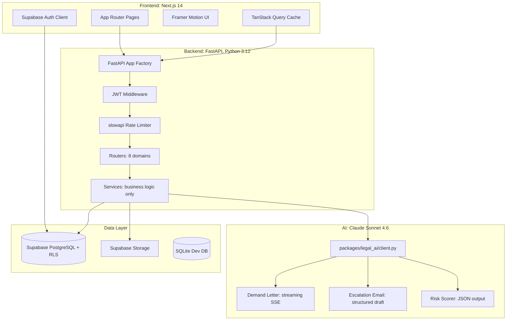

<div align="center">

<h1>freelancer-payment-protection</h1>

<p>
<strong>Claude drafts jurisdiction-referenced demand letters and 0–100 client risk scores with full reasoning, wired into a self-hosted FastAPI + Next.js dashboard and a scriptable CLI.</strong>
</p>

<p>
  <a href="https://github.com/RudrenduPaul/freelancer-payment-protection/actions/workflows/ci.yml"></a>
  <a href="https://pypi.org/project/freelancer-payment-protection-cli/"></a>
  <a href="https://www.npmjs.com/package/freelancer-payment-protection-cli"></a>
  
  
</p>

<p>
  Built by&nbsp;<strong><a href="https://github.com/RudrenduPaul">Rudrendu Paul</a></strong>&nbsp;&amp;&nbsp;<strong><a href="https://github.com/essen-code">Sourav Nandy</a></strong>
</p>


</div>

---

**Note on the license:** this repository is source-available, not open source. Copyright is held by Rudrendu Paul and Sourav Nandy; use beyond installing and running the published CLI package requires written permission. See [License](#license) below before you fork, modify, or redistribute anything.

## Install the CLI

```bash
pip install freelancer-payment-protection-cli
# or: uvx freelancer-payment-protection-cli --help
# or: npx freelancer-payment-protection-cli --help
```

That installs `fpp`, a typed command-line client for the FastAPI backend below (invoices, escalations, client risk scoring, `--json` on every data command). It talks to a `freelancer-payment-protection` API instance you run yourself. See [Run the full stack locally](#run-the-full-stack-locally) to stand one up, or point `FPP_API_URL` at one that's already running.

## Table of Contents

- [What This Is](#what-this-is)
- [Features](#features)
- [Run the full stack locally](#run-the-full-stack-locally)
- [Command-Line Interface](#command-line-interface)
- [API Reference](#api-reference)
- [Comparison](#comparison)
- [Architecture](#architecture)
- [Security](#security)
- [What's Not Implemented Yet](#whats-not-implemented-yet)
- [FAQ](#faq)
- [Contributing](#contributing)
- [License](#license)

---

## What This Is

FreshBooks and HoneyBook stop at "invoice sent." Neither drafts what to say when a client goes quiet, and neither scores a client's risk of non-payment before you start the work. This project is a FastAPI + Next.js app, backed by Claude, that does two specific things well: it drafts a stage-appropriate escalation email or a jurisdiction-referenced demand letter for an overdue invoice, and it scores a client's payment risk from 0–100 with a full factor breakdown, both with an AI-generated confidence/reasoning trail a human reviews before anything goes out.

It is not a set-and-forget automation system. There's no background scheduler enforcing wait times between stages and no live sync with FreshBooks/QuickBooks/Wave today. See [What's Not Implemented Yet](#whats-not-implemented-yet) for the honest gap between the architecture diagram and what's wired up. What's real: the AI drafting, the risk scoring, the evidence locker, and a CLI that scripts all three.

---

## Features

| Capability | What's actually implemented |
|---|---|
| **AI escalation drafting** | Five ordered stages (`polite_reminder` → `firm_notice` → `final_warning` → `legal_demand` → `legal_action`). `POST /api/v1/escalations/{id}/draft` asks Claude for the next stage's subject/body/tone/confidence score. It's a preview: the endpoint doesn't send the email or persist the stage change (`apps/api/app/services/escalation_service.py`). |
| **Jurisdiction-referenced demand letters** | Claude drafts a letter for a jurisdiction string you supply. Four jurisdictions (California, New York, England & Wales, Ontario) have a dedicated template file under `legal-templates/`; any other jurisdiction still gets a draft, formatted from the model's general knowledge rather than a hard-coded template. Every letter carries a fixed AI-disclaimer paragraph. Streams to the UI over SSE via a `threading.Thread` → `queue.Queue` → `asyncio.run_in_executor` bridge (`apps/api/app/services/ai_service.py`), verified real and not just a UI-only typewriter effect. |
| **Client risk scoring** | `POST /api/v1/risk/score` returns a 0–100 score, a level (low/medium/high/critical), and a `factors` array. The prompt asks Claude to weigh 7 named factors (industry payment culture, payment-terms length, historical delay, contract quality, invoice size, geography, outstanding-balance ratio) and return its reasoning. If the Claude call fails, `risk_service.py` falls back to a deterministic heuristic score rather than erroring. Rate-limited to 30 requests/minute. |
| **Evidence locker** | Manual upload of PDF/PNG/JPEG/`.eml`/plain-text files (25MB cap), listed and deletable per invoice, backed by Supabase Storage in production. There's no drag-and-drop auto-capture and no ZIP export endpoint today. Uploads happen one file at a time via `POST /api/v1/evidence/{invoice_id}/upload`. |
| **CLI (`fpp`)** | Every data-returning command supports `--json`. Persistent login against Supabase's own password-grant endpoint, cached to `~/.config/freelancer-payment-protection-cli/credentials.json` (mode 600), transparent refresh. Published on PyPI and npm as `freelancer-payment-protection-cli`. |
| **Security controls** | Row Level Security on every Postgres table (`packages/db/migrations/versions/002_rls_policies.sql`), Supabase JWT auth with no local bypass, `slowapi` rate limiting (10/min on the AI-drafting routes, 30/min on risk scoring, 100/min global), CodeQL on every PR, `pip-audit` + `pnpm audit` dependency scanning, and TruffleHog secret scanning in CI. |

---

## Run the full stack locally

Verified against a fresh clone. **Prerequisites:** Node.js 20+, pnpm 9.x, Python 3.12.x (3.13/3.14 aren't supported by this checkout: 3.14 fails at `pip install` for one of the pinned backend dependencies).

```bash
git clone https://github.com/RudrenduPaul/freelancer-payment-protection.git
cd freelancer-payment-protection
pnpm install

# Backend env
cp apps/api/.env.example apps/api/.env
# apps/api/.env.example ships two values that don't parse as written. See the
# Troubleshooting question in the FAQ before you skip this:
#   ALLOWED_ORIGINS=["http://localhost:3000"]   (needs the JSON-array brackets)
#   delete the DATABASE_URL= line entirely (Settings doesn't accept it; the
#   app already defaults to sqlite:///./dev.db without it)

cp apps/web/.env.example apps/web/.env.local

pip install -r apps/api/requirements.txt
python -m alembic -c packages/db/migrations/alembic.ini upgrade head
python scripts/seed_dev.py

pnpm dev
```

The seed script needs no external services and produces 8 clients, 16 invoices, and pre-generated escalation events, all queryable through the API or the CLI once seeded. Verified end to end in a fresh venv: `alembic upgrade head` runs clean, `seed_dev.py` populates SQLite, and `uvicorn app.main:app` boots and serves `/health` and `/health/ready` once the two `.env` fixes above are applied.

| Service | URL |
|---|---|
| Dashboard | `http://localhost:3000` |
| API + OpenAPI docs | `http://localhost:8000/docs` |

Logging into the **web dashboard** needs a real (free tier is fine) [Supabase](https://supabase.com) project. `apps/api/app/middleware/auth.py` validates a Supabase-issued JWT with no local bypass. The seeded data is fully reachable through the API/CLI without one. AI features (demand letters, risk scoring, escalation drafts) need a real `ANTHROPIC_API_KEY` in `apps/api/.env`; without one, risk scoring falls back to the heuristic score and the other two AI routes return a 503.

---

## Command-Line Interface

Verified against the installed package's actual `--help` output.

```
fpp login                                   Log in (prompts for email/password)
fpp logout                                  Delete cached credentials
fpp whoami [--json]                         Show cached workspace/session info

fpp invoice list [--status] [--client-id] [--page] [--page-size] [--json]
fpp invoice create --client-id --invoice-number --amount --due-date [--currency] [--source-system] [--external-id] [--json]
fpp invoice show <invoice-id> [--json]
fpp invoice set-status <invoice-id> <status> [--json]

fpp escalation list [--json]                Active escalations, grouped by stage
fpp escalation status <invoice-id> [--json] Current stage + full history
fpp escalation advance <invoice-id> [--json] Preview the next stage's AI-drafted email (does not send or persist)

fpp client list [--risk-level] [--search] [--page] [--page-size] [--json]
fpp client show <client-id> [--json]
fpp client risk <client-id> [--json]        Compute/refresh the AI risk score
```

```bash
fpp login
fpp invoice list --status overdue --json | jq '.[] | {id, invoiceNumber, daysPastDue}'
fpp client risk <client-id> --json | jq '.level'
```

`--status` on `invoice list` accepts `disputed`, `overdue`, `paid`, `pending`, `written_off`. Full flag reference for any command: `fpp <command> --help`. Full install, config, and auth walkthrough: [`packages/cli/README.md`](https://github.com/RudrenduPaul/freelancer-payment-protection/blob/main/packages/cli/README.md).


---

## API Reference

Interactive OpenAPI at `http://localhost:8000/docs`. Verified against the router source directly:

```
GET    /health                                Liveness probe
GET    /health/ready                          Readiness (DB)

GET    /api/v1/clients                        List
POST   /api/v1/clients                        Create
GET    /api/v1/clients/{client_id}            Detail
PUT    /api/v1/clients/{client_id}            Update
DELETE /api/v1/clients/{client_id}            Delete

GET    /api/v1/invoices                       List
POST   /api/v1/invoices                       Create (manual)
GET    /api/v1/invoices/{invoice_id}          Detail
PATCH  /api/v1/invoices/{invoice_id}/status   Update status

GET    /api/v1/escalations                    Active escalations
POST   /api/v1/escalations/{invoice_id}/draft    AI-draft next escalation email (preview only)
GET    /api/v1/escalations/{invoice_id}/history  Full history

POST   /api/v1/legal/demand-letter            Generate demand letter
POST   /api/v1/legal/demand-letter/stream     Generate + stream (SSE)

GET    /api/v1/evidence/{invoice_id}          Evidence items
POST   /api/v1/evidence/{invoice_id}/upload   Manual upload
DELETE /api/v1/evidence/{item_id}             Remove

POST   /api/v1/risk/score                     AI risk score, structured JSON

GET    /api/v1/analytics/overview             Dashboard totals
```

---

## Comparison

Every non-`freelancer-payment-protection` row below is sourced from each vendor's own docs/help center, checked in August 2026.

| Capability | Spreadsheets | FreshBooks | HoneyBook | HubSpot | freelancer-payment-protection |
|---|:---:|:---:|:---:|:---:|:---:|
| Overdue-payment reminders | ✗ | Automatic, up to 3 per invoice, configurable timing, template-based | Automatic, 4 fixed timings (7 days before, due day, 2 days after, recurring), template-based | Automated "Payment Reminder" workflow (rule-based) | AI-drafted per stage, tone-calibrated, confidence-scored (preview only, not auto-sent) |
| Jurisdiction-referenced legal demand letters | ✗ | ✗ (not documented) | ✗ (not documented) | ✗ (not documented) | AI-drafted; 4 jurisdictions have a dedicated template (CA, NY, UK, Ontario) |
| Client/invoice risk scoring | ✗ | ✗ (not documented) | ✗ (not documented) | **Breeze Invoice Prioritization**, an AI ranking of overdue invoices by risk/age/customer value, Revenue Hub public beta as of June 2026; no published 0–100 score or per-factor reasoning | 0–100 score, 7 named factors, full AI reasoning returned per client, heuristic fallback if AI is down |
| Evidence/document storage per invoice | ✗ | ✗ (not documented) | ✗ (not documented) | ✗ (not documented) | Manual upload, Supabase Storage-backed, no ZIP export yet |
| Streaming AI generation in the UI | ✗ | ✗ | ✗ | ✗ | Real SSE streaming (verified in source, not just a UI animation) |
| Native invoicing | ✗ | Yes (core product) | Yes (core product) | Yes (Commerce/Payments) | No. Invoices are created via API/CLI, not synced from an accounting tool today |
| Background job automation (sync, scheduled escalation) | N/A | Native | Native | Native | Not implemented. See [What's Not Implemented Yet](#whats-not-implemented-yet) |

The honest read: FreshBooks and HoneyBook are stronger at the mechanical, rule-based reminder they already do well. HubSpot's June 2026 Breeze beta is the closest thing to a competing risk-scoring feature on this list and is worth watching. Nobody here drafts a jurisdiction-referenced demand letter or streams AI generation into the UI; that's the actual gap this project fills, not "full collection automation," which none of these, including this project, deliver end to end yet.

---

## Architecture

### System diagram (what's actually implemented)


```mermaid
graph TB
    subgraph "Frontend: Next.js 14"
        A[App Router Pages]
        B[TanStack Query Cache]
        C[Framer Motion UI]
        D[Supabase Auth Client]
    end

    subgraph "Backend: FastAPI, Python 3.12"
        E[FastAPI App Factory]
        F[JWT Middleware]
        G[slowapi Rate Limiter]
        H["Routers: 8 domains"]
        I[Services: business logic only]
    end

    subgraph "AI: Claude Sonnet 4.6"
        J[packages/legal_ai/client.py]
        K[Demand Letter: streaming SSE]
        L[Escalation Email: structured draft]
        M[Risk Scorer: JSON output]
    end

    subgraph "Data Layer"
        T[(Supabase PostgreSQL + RLS)]
        U[Supabase Storage]
        W[(SQLite Dev DB)]
    end

    A --> E
    D --> T
    B --> E
    E --> F --> G --> H --> I
    I --> J
    J --> K
    J --> L
    J --> M
    I --> T & U
```

Celery and Redis are declared dependencies (`requirements.txt`) with no worker code in the repository today: no `apps/workers/` directory exists, and there is no scheduled job that advances an invoice's stage automatically. See [What's Not Implemented Yet](#whats-not-implemented-yet).

### Why Python for the backend, not Node

Legal document drafting uses `python-docx`/`WeasyPrint` in the code paths that are wired up for it, and the Anthropic Python SDK is the reference implementation. The Python ecosystem is also where contract-analysis tooling (NLTK, spaCy) would live for a future dispute-analysis feature.

### Why centralize all Claude calls in one file

`packages/legal_ai/client.py` (called from `apps/api/app/services/ai_service.py`) is the only place the Anthropic SDK is imported. Model version, retries, and the sync-SDK/async-FastAPI bridge live there, so upgrading the model is a one-file change.

### Why Pydantic Settings with fail-fast validation

`settings = Settings()` runs at import time. If `ANTHROPIC_API_KEY` is absent, the app raises before serving a request rather than degrading silently. The tradeoff: the settings model is strict about unrecognized fields too, which is the root cause of one of the two `.env.example` issues in the FAQ below.

---

## Security

| Control | Implementation |
|---|---|
| Authentication | Supabase JWT validated on every protected route, no local bypass |
| Authorization | Row Level Security on every table, with workspace isolation enforced at the database, not the app layer |
| Secrets | Pydantic `SecretStr`; app fails to start if a required var is missing |
| Input validation | Pydantic v2 on every endpoint |
| Rate limiting | 100 req/min global default; 10/min on the AI-drafting routes; 30/min on risk scoring |
| SQL injection | SQLAlchemy ORM only, no raw SQL in the routers/services reviewed |
| Evidence access | Uploaded files validated by MIME type and size (25MB cap) before storage |
| Dependency audit | `pip-audit` (backend) + `pnpm audit` (frontend), both run in CI |
| Secret scanning | TruffleHog on every push/PR |
| SAST | CodeQL (Python + TypeScript) on every PR |

---

## What's Not Implemented Yet

Being direct about this because the architecture diagrams and dependency list overstate it otherwise:

- **No background worker or scheduler.** `celery` and `redis` are pinned in `requirements.txt`, but no `apps/workers/` code exists in the repository. Nothing advances an invoice's escalation stage automatically or on a timer.
- **No minimum-wait-time enforcement.** `escalation_service.py`'s `get_next_stage()` is a plain ordered lookup with no date/timedelta check anywhere in the call path. Any authenticated caller can request a draft for the next stage regardless of how long the invoice has been overdue; the endpoint also never writes the new stage back to the invoice.
- **No FreshBooks/QuickBooks/Wave sync.** `packages/integrations/__init__.py` is an empty file. Invoices are created through the API/CLI, not synced from an accounting tool.
- **No production PDF/DOCX export yet.** `doc_gen_service.py`'s docstring says it plainly: dev builds save the drafted letter as a `.txt` file; the `python-docx`/WeasyPrint production path is not wired up.
- **No evidence ZIP export.** The evidence router supports list/upload/delete only.

None of this is secret. It's what running the code shows. The parts that are real (AI drafting, risk scoring with reasoning, streaming, the CLI) are described above with specifics, not adjectives.

---

## FAQ

**What is this, and what's the actual differentiator versus FreshBooks or HoneyBook?**
Both of those handle sending an invoice and reminding a client on a fixed schedule. Neither drafts a jurisdiction-referenced legal demand letter or scores a client's payment risk with an AI-generated reasoning trail. This project does both, backed by a real Claude API call you can see in `packages/legal_ai/` and `apps/api/app/services/`, not a canned template swap.

**Is this open source? Can I fork it or use the code in my own project?**
No. It's source-visible, not open source. The `LICENSE` file is a proprietary license: copying, modifying, or redistributing any part of this repository requires prior written approval from both Rudrendu Paul and Sourav Nandy. The published `freelancer-payment-protection-cli` package on PyPI/npm is installable and runnable as-is; that's a separate permission from using or modifying the source.

**What platforms does the CLI support?**
Python 3.10–3.13 on Linux, macOS, or Windows, installed via `pip`, `uvx`, or `pipx`. The npm package (`freelancer-payment-protection-cli` on npm) is a thin wrapper that shells out to `uvx` or `pipx` at runtime rather than bundling a platform binary; it needs one of those two on `PATH`. Running the full backend/frontend stack needs Python 3.12.x specifically; 3.13/3.14 aren't supported by the current dependency pins.

**How is this different from HubSpot's new Breeze Invoice Prioritization feature?**
Breeze (Revenue Hub, public beta as of June 2026) ranks a HubSpot user's overdue invoices by risk, age, and customer value, closer to a sort order than a score. `fpp client risk` returns a 0–100 score with a named-factor breakdown and a written reasoning paragraph per client, works standalone without adopting the rest of HubSpot's CRM, and pairs with jurisdiction-referenced demand-letter drafting that HubSpot doesn't offer. Worth revisiting as Breeze comes out of beta.

**I followed the Quick Start exactly and `uvicorn app.main:app --reload` crashed on startup. Is that a bug?**
Yes, a real one in the shipped `apps/api/.env.example`. Two of its default values don't survive `Settings()`'s validation: `ALLOWED_ORIGINS=http://localhost:3000` needs to be a JSON array (`["http://localhost:3000"]`) because the field is typed `list[str]`, and `DATABASE_URL=sqlite:///./dev.db` isn't a field the `Settings` model declares at all, so it fails with `Extra inputs are not permitted`. Fix both lines in your `.env` (or just delete the `DATABASE_URL` line; `apps/api/app/database.py` already defaults to that same SQLite path independently) and the server boots. Confirmed by running the documented steps in a clean clone.

**Does `fpp escalation advance` actually send the email or move the invoice forward?**
No. It calls `/api/v1/escalations/{id}/draft`, which returns an AI-drafted preview only. The backend has no endpoint today that persists a stage change or sends the email. See [What's Not Implemented Yet](#whats-not-implemented-yet).

**What happens if I don't have an `ANTHROPIC_API_KEY` set?**
The app still starts once the two `.env` fixes above are applied, but the AI routes behave differently: `client risk` falls back to a deterministic heuristic score (documented in `risk_service.py`), while `escalation advance` and the demand-letter endpoints return a 503 with no fallback.

**Can I use this for a real client engagement today?**
For the CLI against your own self-hosted backend and Supabase project, yes, within the license terms above. For anything beyond installing and running the package as published, such as forking, redistributing, or embedding it in another product, you need written permission from the owners first.

---

## Contributing

This is proprietary software, not a community-governed open source project. GitHub Issues are open for bug reports. Code contributions (PRs) are possible on a case-by-case basis but require prior written permission per the license before any submitted code can be merged or reused. Reach out via [github.com/RudrenduPaul](https://github.com/RudrenduPaul) first.

## License

Proprietary. Copyright (c) 2026 Rudrendu Paul and Sourav Nandy. All rights reserved. Personal, academic, commercial, or scheduled use requires explicit written permission from both owners. See [`LICENSE`](./LICENSE) for full terms. Installing and running the published `freelancer-payment-protection-cli` package from PyPI/npm as distributed does not require separate permission; modifying, forking, or redistributing the source does.

**Contact:** [github.com/RudrenduPaul](https://github.com/RudrenduPaul)

---

<div align="center">

*Built by Rudrendu Paul and Sourav Nandy · Developed with [Claude Code](https://claude.ai/code)*

</div>
